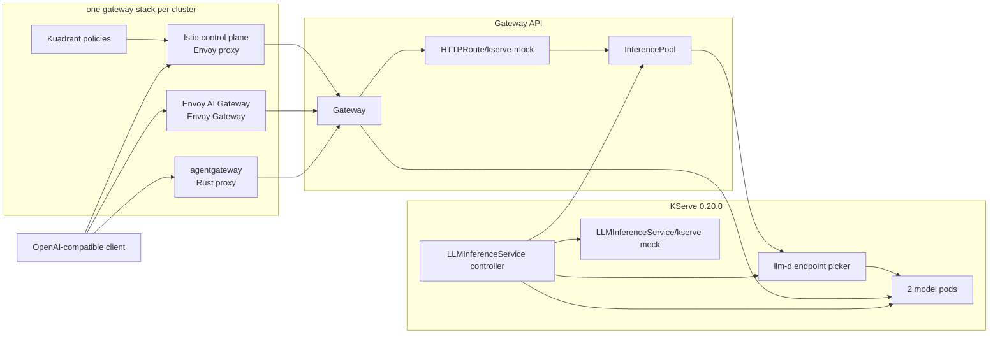

# KServe LLMInferenceService gateway comparison

This repository runs the same KServe inference path through three Gateway API
stacks:

```text
Gateway -> HTTPRoute -> InferencePool -> llm-d endpoint picker -> model pod
```

The default deployment is a deterministic CPU fixture for comparing routing,
OpenAI-compatible APIs, and gateway behavior on kind. An optional policy layer
adds Keycloak authentication, authorization, rate limits, quotas, token budgets,
and CORS. A separate production package deploys real, task-specific vLLM
services on NVIDIA GPUs.

Shared components are pinned once per cluster: KServe 0.20.0 and Keycloak
26.4.0. All Helm charts and CRD schemas are vendored in the repository.

## Gateway comparison

This is the canonical gateway comparison. Other tables in this README describe
models, APIs, accelerator pools, or deployment platforms—not differences
between the three gateways.

| Comparison | OpenShift profile (Kuadrant) | Envoy AI Gateway | agentgateway |
|---|---|---|---|
| Pinned stack | Kuadrant 1.5.2, Istio 1.29.2, Envoy proxy | Envoy AI Gateway 1.0.0, Envoy Gateway 1.8.1 | agentgateway 1.4.1 |
| Local URL | <http://localhost:8082> | <http://localhost:8080> | <http://localhost:8081> |
| Data plane | Envoy managed by Istio | Envoy managed by Envoy Gateway | agentgateway Rust proxy |
| Gateway topology | OpenShift-aligned shared `Gateway/openshift-ai-inference` in `openshift-ingress` | `Gateway/ai-gateway` in `ai-demo` | `Gateway/ai-gateway` in `ai-demo` |
| JWT authentication | `AuthPolicy` `authentication.jwt` | `SecurityPolicy` `jwt.providers` | `AgentgatewayPolicy` `traffic.jwtAuthentication` |
| Browser OIDC | `OIDCPolicy` | `SecurityPolicy` `oidc` | MCP OAuth metadata and Keycloak preset |
| API keys | Secret-backed `AuthPolicy` `authentication.apiKey` | `SecurityPolicy` `apiKeyAuth` | `traffic.apiKeyAuthentication` |
| Client mTLS | `AuthPolicy` `authentication.x509` | `ClientTrafficPolicy` | `frontend.tls` |
| External authorization | `AuthPolicy` HTTP metadata, OPA, or SpiceDB | `SecurityPolicy` `extAuth` | `traffic.extAuth` |
| External processing (ext_proc) | No policy API; an Istio `EnvoyFilter` patches raw Envoy configuration | `EnvoyExtensionPolicy` `extProc` | `traffic.extProc` |
| Authorization rules | Pattern matching, CEL, or OPA Rego | Claim/header rules; first match wins | CEL `matchExpressions`; Allow, Deny, or Require |
| Request rate limits | `RateLimitPolicy` | `BackendTrafficPolicy`, local or global | `traffic.rateLimit`, local or global |
| Long quota windows | Any window through 24 hours in the same policy | Day, Month, or Year | Local mode stops at Hours; longer windows require global rate limiting |
| Token budgets | `TokenRateLimitPolicy` reads response `usage.total_tokens` | `llmRequestCosts` through the AI Gateway ext-proc | `unit: Tokens` descriptor |
| Counter storage | Limitador installed by the operator | External Redis and rate-limit service for global limits | In-process for local limits |
| Per-identity buckets | CEL counters over authenticated identity | Header descriptors | CEL descriptors in global mode; local mode is shared per proxy |
| LLM request shaping | Not provided by the compared policy | `AIGatewayRoute` body/header mutation | Model aliases, prompt prepend/append, and caching |
| Prompt guardrails | Not provided by the compared policy | Not provided by the compared policy | `backend.ai.promptGuard` |
| Provider credentials | Not provided by the compared policy | `BackendSecurityPolicy` | Backend authentication on `AgentgatewayBackend` |
| MCP routing | Not provided by the compared policy | `MCPRoute` | Native MCP routing with OAuth |
| Telemetry controls | `TelemetryPolicy` metric labels | `EnvoyProxy` telemetry | `frontend.metrics`, tracing, and access logs |
<!-- comparison-results:start -->
| Last live comparison (UTC) | 2026-08-24 15:52 (30 requests) | 2026-08-24 15:52 (30 requests) | 2026-08-24 15:52 (30 requests) |
| Gateway Programmed | Yes | Yes | Yes |
| `LLMInferenceService` Ready | Yes | Yes | Yes |
| Route Accepted / ResolvedRefs | Yes / Yes | Yes / Yes | Yes / Yes |
| Workload replicas | 2/2 | 2/2 | 2/2 |
| KServe-owned Deployments, Services, and Pool | 5 | 5 | 5 |
| Latest routing sample | 30/30 HTTP 200, 2 pods, 0 unknown | 30/30 HTTP 200, 2 pods, 0 unknown | 30/30 HTTP 200, 2 pods, 0 unknown |
| Streaming usage chunk | Yes | Yes | Yes |
| Embeddings API | Yes | Yes | Yes |
| Reranking API | Yes | Yes | Yes |
| Model catalog | Not recorded | Not recorded | Not recorded |
| Tiered chat models | Not recorded | Not recorded | Not recorded |
| RAG embedding models | Not recorded | Not recorded | Not recorded |
| Speech-to-text API | Yes | Yes | Yes |
| Speaker diarization | Not recorded | Not recorded | Not recorded |
| Local chat p50 | 299 ms | 230 ms | 307 ms |
| Policy objects reporting ready | Baseline `RateLimitPolicy`: Yes | Not measured | Not measured |
| Keycloak token issuance | Not measured | Not measured | Not measured |
| Authentication: anonymous / forged / valid | Not measured | Not measured | Not measured |
| Authorization: guest / non-admin B300 / admin B300 | Not measured | Not measured | Not measured |
| Request rate limit | Not measured | Not measured | Not measured |
| Quota limit | Not measured | Not measured | Not measured |
| Token limit | Not measured | Not measured | Not measured |
| CORS preflight answered | Not measured | Not measured | Not measured |
<!-- comparison-results:end -->

`make compare` replaces only the rows between the comparison markers above.
After each successful scheduled or manually dispatched run, the workflow
commits the updated README. These are regression smoke tests against a
zero-delay Python runtime, not production performance benchmarks.

Kuadrant is a policy control plane, not a proxy. The OpenShift profile combines
Kuadrant with Istio and Envoy to reproduce the OpenShift shared-Gateway shape;
it is an architectural analogue, not a Red Hat certification claim.

Three operational differences explain most of the matrix:

- Kuadrant includes Limitador, Envoy global rate limiting needs Redis and a
  rate-limit service, and agentgateway local limits live in each proxy.
- Daily quotas are native to Kuadrant and Envoy. agentgateway needs global mode
  for both long windows and identity-keyed buckets.
- Envoy token accounting runs through `AIGatewayRoute` ext-proc traffic. The
  repository therefore protects both that generated route and the ordinary
  `HTTPRoute`, and sends both to the same `InferencePool`.

## Quick start

Prerequisites: Docker, kind, kubectl, Helm, curl, and Python 3.

```bash
make up
make compare
```

`make up` creates one kind cluster per gateway stack. The separate clusters
prevent one installer from upgrading another stack's cluster-scoped Gateway
API or inference-extension CRDs.

Add the optional security and traffic layer:

```bash
make policies
make compare
```

Add the optional semantic routing layer:

```bash
make semantic-router
make compare
```

Useful lifecycle and validation targets:

```bash
make status
make pools
make pools-down
make policies-down
make semantic-router-down
make test
make validate
make agent-ui
make down
```

`make agent-ui` exposes the agentgateway UI at <http://localhost:15000/ui>.

## Architecture

Each kind cluster has the same KServe workload, scheduler, pool, route, and
model API. Only the gateway implementation and its policy resources change.



The OpenShift profile applies a Kustomize overlay that changes the Gateway
reference to `openshift-ingress/openshift-ai-inference` and supplies the
trusted endpoint-picker certificate chain required by Istio.

## Runtime profiles

### CPU mock fixture

The default `LLMInferenceService` has two Python replicas. Storage
initialization is disabled and `mock-llm/server.py` is mounted from a ConfigMap.
The runtime loads no weights and contacts no model provider.

It exposes the API subset used by the production vLLM validator:

| Capability | Endpoint | Contract |
|---|---|---|
| Models | `GET /v1/models`, `GET /v1/models/{id}` | OpenAI model objects plus fixture task, tier, and placement metadata |
| Chat | `POST /v1/chat/completions` | OpenAI JSON and SSE; usage is included in streams only when requested |
| Embeddings | `POST /v1/embeddings` | OpenAI list response for string or string-array input |
| Reranking | `POST /rerank`, `/v1/rerank`, `/v2/rerank` | vLLM query/documents schema; documents are returned only with `return_documents: true` |
| Transcription | `POST /v1/audio/transcriptions` | OpenAI multipart file, model, and response format |

The mock adds `mock_*` observability fields. Its `diarization` and
`num_speakers` transcription fields are fixture extensions and are not part of
the shared vLLM contract.

Try the same requests through any local gateway URL:

```bash
BASE=http://localhost:8082

curl "$BASE/v1/chat/completions" \
  -H 'content-type: application/json' \
  -d '{"model":"mock-kserve","messages":[{"role":"user","content":"hello"}]}'

curl "$BASE/v1/embeddings" \
  -H 'content-type: application/json' \
  -d '{"model":"mock-embedding","input":["gateway inference","KServe routing"]}'

curl "$BASE/v1/rerank" \
  -H 'content-type: application/json' \
  -d '{"model":"mock-reranker","query":"gateway inference","documents":["unrelated","gateway inference routing"],"top_n":1,"return_documents":true}'

curl "$BASE/v1/audio/transcriptions" \
  -F 'file=@sample.wav;type=audio/wav' \
  -F 'model=mock-whisper'
```

#### Mock model catalog

Every identifier below is a fixture. Unknown models return HTTP 404
`model_not_found`; models sent to the wrong task return HTTP 400.

| Model | Task | Tier | Placement | Relevant limits/features |
|---|---|---|---|---|
| `kimi-k3` | Chat | Big | B300 | 262144 context, 16384 output |
| `glm-5.3` | Chat | Big | B300 | 204800 context, 16384 output |
| `deepseek-v4-pro` | Chat | Big | B300 | 163840 context, 32768 output |
| `deepseek-v4-flash` | Chat | Medium | H200 | 131072 context, 8192 output |
| `qwen3.8-27b` | Chat | Small | H100 | 65536 context, 8192 output |
| `mock-kserve` | Chat | Fixture | CPU | 8192 context, 1024 output |
| `qwen3-embedding-8b` | Embedding | Big | H100 | 4096 dimensions, Matryoshka |
| `e5-mistral-7b-instruct` | Embedding | Big | H100 | 4096 dimensions |
| `bge-m3` | Embedding | Medium | L40S | 1024 dimensions |
| `jina-embeddings-v3` | Embedding | Medium | L40S | 1024 dimensions, Matryoshka |
| `nomic-embed-text-v2-moe` | Embedding | Small | L40S | 768 dimensions, Matryoshka |
| `mock-embedding` | Embedding | Fixture | CPU | 8 dimensions |
| `bge-reranker-v2-m3` | Rerank | Medium | L40S | 256 documents |
| `jina-reranker-v2-base-multilingual` | Rerank | Small | L40S | 128 documents |
| `mock-reranker` | Rerank | Fixture | CPU | 64 documents |
| `whisper-large-v3` | Transcription | Big | L40S | ASR, timestamps, mock diarization up to 8 speakers |
| `voxtral-small-24b` | Transcription | Big | H100 | ASR, timestamps, mock diarization up to 8 speakers |
| `voxtral-mini-3b` | Transcription | Small | L40S | ASR and timestamps; no diarization |
| `mock-whisper` | Transcription | Fixture | CPU | ASR, timestamps, mock diarization up to 4 speakers |

Chat responses expose the selected tier through `mock_tier`, message content,
and deterministic completion usage. Matryoshka embedding fixtures accept a
smaller `dimensions` value; other embedding fixtures reject it.

#### Accelerator routing fixture

`make pools` adds one mock serving pool per intended accelerator class. These
resources validate placement, header routing, pool ownership, and wrong-pool
errors on kind; they do not turn the Python container into a GPU model server.

| Pool | Intended accelerator | Models |
|---|---|---|
| `kserve-b300` | NVIDIA B300 | `kimi-k3`, `glm-5.3`, `deepseek-v4-pro` |
| `kserve-h200` | NVIDIA H200 | `deepseek-v4-flash` |
| `kserve-h100` | NVIDIA H100 | `qwen3.8-27b`, both large embedding models, `voxtral-small-24b` |
| `kserve-l40s` | NVIDIA L40S | Light embeddings, both rerankers, `whisper-large-v3`, `voxtral-mini-3b` |
| `kserve-mock` | CPU | The four `mock-*` task fixtures |

Select a pool with `x-model-class`. Requests without it use the shared route:

```bash
curl "$BASE/v1/chat/completions" \
  -H 'content-type: application/json' \
  -H 'x-model-class: b300' \
  -d '{"model":"kimi-k3","messages":[{"role":"user","content":"hello"}]}'
```

`mock_accelerator` reports the runtime that actually answered; the shared
fixture reports `all`. `model_accelerator` reports the model's intended class.
A model sent to the wrong pool returns HTTP 404 `model_not_served_here`.

### Production vLLM

`kserve/production/` replaces the combined fixture with one independently
scalable vLLM `LLMInferenceService` per model and task:

| Route header | Hugging Face model | Served name | API | Reference GPU |
|---|---|---|---|---|
| `x-model-service: chat` | `Qwen/Qwen3-8B` | `qwen3-8b` | Chat and models | H100 |
| `x-model-service: embedding` | `Qwen/Qwen3-Embedding-8B` | `qwen3-embedding-8b` | Embeddings | H100 |
| `x-model-service: rerank` | `BAAI/bge-reranker-v2-m3` | `bge-reranker-v2-m3` | Rerank | L40S |
| `x-model-service: transcription` | `openai/whisper-large-v3-turbo` | `whisper-large-v3-turbo` | Transcription | L40S |

The shared runtime config uses the official pinned
[`vllm/vllm-openai:v0.27.0` image](https://docs.vllm.ai/en/v0.27.0/deployment/docker/),
`/health` probes, in-memory `/dev/shm`, writable vLLM/Hugging Face caches,
non-root UID 2000, equal GPU requests and limits, KServe storage
initialization, and the same `InferencePool`/endpoint-picker data path as the
mock. Version 0.27.0 includes the fix for
[GHSA-7m6h-x95x-82q5](https://github.com/vllm-project/vllm/security/advisories/GHSA-7m6h-x95x-82q5).

Deploy to a KServe 0.20 cluster with NVIDIA GPU nodes and an existing
`ai-demo/ai-gateway`:

```bash
make vllm-production VLLM_CONTEXT=my-gpu-context
make vllm-validate VLLM_BASE_URL=https://gateway.example.com
make vllm-production-down VLLM_CONTEXT=my-gpu-context
```

The deploy script fails before mutation if no node advertises allocatable
`nvidia.com/gpu`. GPU labels, model sizes, credentials, storage, and replica
counts are reference defaults and should be overlaid for the target cluster.

## Gateway policy test layer

`make up` leaves `/v1` open so routing can be tested without credentials.
`make policies` installs Keycloak and each gateway's native policy resources
against the same `HTTPRoute` and `InferencePool`.

The configured behavior is identical:

- valid Keycloak access token required; anonymous and forged tokens get 401;
- `model-users` membership required; B300 additionally requires
  `platform-admins`, producing 403 for an authenticated but unauthorized user;
- 5 requests per minute;
- 3 requests per long quota window;
- 100 LLM tokens per minute, charged from model token usage;
- CORS preflight for `https://console.example.com`.

Probe headers isolate rate-limit tests from ordinary traffic:
`x-rate-limit-probe`, `x-quota-probe`, and `x-token-limit-probe`. Kuadrant and
Envoy use the probe value as a quota key. agentgateway's local quota is shared
inside the proxy, which is recorded in the canonical comparison table.

### Test identities

Each cluster exposes its own `ai-gateway` Keycloak realm through the same
gateway endpoint as inference traffic.

| User | Password | Groups | Plan | Expected access |
|---|---|---|---|---|
| `alice` | `alice` | `platform-admins`, `model-users` | Gold | Every model class |
| `bob` | `bob` | `model-users` | Free | Everything except B300 |
| `mallory` | `mallory` | `guests` | Free | HTTP 403 on `/v1` |

```bash
BASE=http://localhost:8082
TOKEN=$(curl -sS "$BASE/realms/ai-gateway/protocol/openid-connect/token" \
  -d grant_type=password -d client_id=ai-gateway-cli \
  -d username=alice -d password=alice |
  python3 -c 'import json,sys; print(json.load(sys.stdin)["access_token"])')

curl "$BASE/v1/chat/completions" \
  -H "authorization: Bearer $TOKEN" \
  -H 'content-type: application/json' \
  -d '{"model":"mock-kserve","messages":[{"role":"user","content":"hello"}]}'
```

## Semantic routing layer

`make semantic-router` puts the [vLLM Semantic
Router](https://github.com/vllm-project/semantic-router) in front of the same
KServe path, as each gateway's external processor. It is the upstream release
image, `ghcr.io/vllm-project/semantic-router/extproc:v0.3.0`, deployed
identically in all three clusters; only the attachment differs, and that is
what this layer compares.

An attachment object exists before the proxy is using it, so `make
semantic-router` waits for each policy to report `Accepted`, and `make compare`
waits for each gateway to actually rewrite an `auto` request before it measures
anything — the only propagation check that covers the status-less `EnvoyFilter`
as well. A gateway that never starts routing still records the negative.

This layer's manifests and decisions pass the offline checks below, but the
rows it adds have not yet been filled in by a live run. Run `make
semantic-router && make compare`, or dispatch the comparison workflow, to
record them.

A request that names a model is forwarded unchanged, so every other row in the
comparison is unaffected. A request whose model is `auto` is resolved by the
router: it reads the prompt, rewrites the body's `model` field, replaces the
system prompt, and names its choice upstream in `x-selected-model`. The gateway
then routes the rewritten request down the ordinary `HTTPRoute` and
`InferencePool`, so the decision is visible in the answer itself.

The decision is reported in both directions, and the comparison measures each
separately. Upstream, the runtime reports the model and system prompt it was
handed, which is what proves the rewrite survived the gateway. Downstream, the
router adds `x-vsr-selected-decision`, `x-vsr-selected-reasoning`, and related
headers to the response, which is what proves the gateway propagates an
external processor's response-header mutations back to the client.

```bash
BASE=http://localhost:8082
curl "$BASE/v1/chat/completions" -H 'content-type: application/json' \
  -d '{"model":"auto","messages":[{"role":"user","content":"prove that the square root of two is irrational"}]}'

# -> "model": "kimi-k3", "mock_tier": "big"
```

| Prompt | Decision | Selected model | Tier |
|---|---|---|---|
| Proofs, derivations, step-by-step quantitative work | `deep-reasoning` | `kimi-k3` | Big, B300 |
| Programming, debugging, refactoring | `code` | `deepseek-v4-flash` | Medium, H200 |
| Greetings and short conversational turns | `small-talk` | `qwen3.8-27b` | Small, H100 |
| No decision matched | Default | `mock-kserve` | Fixture, CPU |

### How each gateway attaches it

| Stack | Attachment | Status to check |
|---|---|---|
| OpenShift profile | Istio `EnvoyFilter` inserting `envoy.filters.http.ext_proc` into the gateway listener | None; `EnvoyFilter` has no status |
| Envoy AI Gateway | `EnvoyExtensionPolicy` `extProc` targeting the `HTTPRoute` | `Accepted` |
| agentgateway | `AgentgatewayPolicy` `traffic.extProc` targeting the `HTTPRoute` | `Accepted` |

The OpenShift profile is the outlier: Kuadrant has no external-processing
policy and Istio's Gateway API support does not cover ext_proc either, so the
filter is written in Envoy's own field names and patched into the listener,
with no controller status to confirm it was accepted. A `DestinationRule`
disables mesh mTLS toward the router, which otherwise fails the handshake — and
because the filter fails open, would leave every request silently unrouted. All
three attachments fail open by design: a router that is down leaves inference
working with the client's original model.

### Decisions are keyword rules, not the classifier

[semantic-router/config/router-config.yaml](semantic-router/config/router-config.yaml)
matches decisions with keyword rules, which are regular expressions evaluated
in-process. That is a deliberate fixture choice with two consequences: the
router downloads no model weights, so the pod requests 256 MiB and starts
without waiting on HuggingFace, and the same prompt yields the same decision on
every run — which is what makes the comparison row meaningful.

Real intent classification uses `domain` conditions instead, backed by the MoM
classifier models the router fetches from HuggingFace at startup. That profile
needs roughly 3 GiB of memory and a 10 GiB volume per cluster, and its first
start waits on the download, so it is not what the three-cluster comparison
runs. To use it, replace each decision's `keyword` condition with a `domain`
condition, declare the domains under `routing.signals.domains`, and raise the
Deployment's resources accordingly; the upstream
[Helm chart](https://github.com/vllm-project/semantic-router/tree/main/deploy/helm/semantic-router)
carries a complete example.

## Deployment targets

Do not install upstream KServe and the OpenShift AI-managed distribution in
the same cluster.

| Condition | Automated kind reference | Red Hat OpenShift AI guidance |
|---|---|---|
| Purpose | Local gateway and API comparison | OpenShift-managed model serving |
| Platform | kind, Kubernetes 1.36.1 | OpenShift Container Platform 4.19.9 or later |
| KServe | Upstream 0.20.0 installed by this repository | Managed by Red Hat OpenShift AI 3.5 |
| LLM API | `serving.kserve.io/v1alpha2` | Use the version installed by the selected OpenShift AI release; currently documented as `v1alpha1` |
| Gateway | Repository installs each GatewayClass and Gateway | Pre-existing GatewayClass and `openshift-ingress/openshift-ai-inference` |
| Runtime | CPU fixture by default; optional production vLLM package | Enabled OpenShift AI serving runtime, normally vLLM for LLMs |
| Installation | `make up` | Configure OpenShift AI; do not run `scripts/install-kserve.sh` |
| Validation here | Automated | Compatibility guidance only |

The automated path also installs Gateway API and Inference Extension CRDs and
cert-manager 1.17.0. It requires no GPU, model download, or object store.

For the OpenShift AI distributed-inference path:

- OpenShift Service Mesh v2 must not be installed for this topology;
- bare-metal clusters need an external Gateway Service entry point such as
  MetalLB;
- authentication must protect the inference endpoint;
- LeaderWorkerSet is optional normally and required when tensor, pipeline, or
  data parallelism spans more than eight accelerators;
- use the API version, storage, security context, runtime, and accelerator
  configuration supplied by the installed OpenShift AI release.

The OpenShift profile in this repository preserves the shared Gateway name,
namespace, cross-namespace route attachment, Kuadrant policy shape, and trusted
endpoint-picker TLS topology. Istio stands in for the OpenShift Gateway
controller because the Ingress Operator is unavailable on kind.

## Validation

Run all local runtime and manifest checks:

```bash
make test
make validate
```

`make test` includes the shared contract validator for model listing, chat,
streaming usage, embeddings, reranking, and WAV transcription. `make validate`
checks repository manifests against vendored structural CRD schemas and reports
unknown fields, wrong types, invalid enum values, and missing required fields.

The router's decisions are a ConfigMap, so no CRD schema covers them.
`make validate` therefore also checks them against the catalog they route to:
every selectable model is a chat model the runtime serves, every decision
resolves to exactly one keyword rule at a distinct priority, and the three
prompts `make compare` sends select three different models — read out of the
comparison script itself, so a changed prompt or keyword fails the check rather
than quietly reporting the default model as a routing decision.

`make compare` adds live-cluster assertions:

- Gateway Programmed and route Accepted/ResolvedRefs conditions;
- KServe readiness and ownership of workload, Services, scheduler, and pool;
- distribution across both model pods;
- model catalog and tier-correct routing;
- streaming chat usage, embeddings, reranking, transcription, and diarization;
- p50 local request latency;
- policy readiness, authentication, authorization, rate limit, quota, token
  budget, and CORS when the optional policy layer is installed;
- ext_proc attachment, the model chosen for each of three prompts, the model and
  system prompt the runtime received, the decision headers returned to the
  client, and auto-routed p50 latency when the optional semantic routing layer
  is installed.

Results update the marked rows in this README directly; no separate report is
created. Offline schema validation cannot prove controller acceptance; only
the live comparison can do that.

### Continuous integration

Both workflows use standard GitHub-hosted runners, which are free for public
repositories:

| Workflow | Scope | Trigger | Typical duration |
|---|---|---|---|
| `.github/workflows/checks.yml` | `make test` and `make validate` | Every push and pull request | About 1 minute |
| `.github/workflows/comparison.yml` | `make up`, optional policies, optional semantic router, and `make compare` | Manual dispatch and Mondays at 06:00 UTC | 45–75 minutes |

The full comparison creates all three kind clusters on one runner. It removes
unused preinstalled toolchains to free disk space and raises inotify limits for
the three sets of kubelets and controllers. Manual dispatch accepts whether to
install policies, whether to install the semantic router, and how many chat
requests to sample per gateway. Successful
results replace the marked comparison rows, are committed to `README.md`, and
are added to the job summary. Failed runs upload pod, policy, and event
diagnostics for each cluster.

A standard runner provides 4 CPUs and 16 GB RAM for all three stacks. If that
becomes insufficient, the next scaling step is one cluster per matrix job and a
final job that merges per-stack comparison fragments.

## Resource ownership

| Owner | Resources | Purpose |
|---|---|---|
| Repository | `GatewayClass`, `Gateway`, `HTTPRoute` | Select the gateway and connect `/v1` to KServe |
| Repository | `LLMInferenceService` and `LLMInferenceServiceConfig` | Declare model workload, replicas, runtime, router, and scheduler |
| Repository | Keycloak workload, realm, Service, and route | Issue the tokens used by all policy tests |
| Repository | Stack-native policy resources | Configure equivalent auth, authorization, limits, quota, tokens, and CORS |
| OpenShift profile overlay | Shared Gateway refs, cert-manager certificates, `BackendTLSPolicy` | Reproduce the OpenShift namespace and trusted EPP connection |
| KServe controller | Workload and scheduler Deployments/Services, `InferencePool`, RBAC | Reconcile and operate the inference data path |

The core desired state is `LLMInferenceService/kserve-mock` with two replicas,
`model.name: mock-kserve`, `HTTPRoute/kserve-mock`, and a scheduler-managed
`InferencePool`.

### KServe resource map

The KServe directory is organized as follows:

| Path | Purpose |
|---|---|
| `kserve/manifests/llmisvc.yaml` | Two CPU mock replicas and the complete llm-d scheduler |
| `kserve/manifests/route.yaml` | Shared `/v1` inference route |
| `kserve/manifests/cpu-presets.yaml` | Prevents KServe GPU/vLLM presets from merging into the laptop fixture |
| `kserve/manifests/envoy-inferencepool-rbac.yaml` | Allows Envoy Gateway to watch `InferencePool`; other stacks install equivalent RBAC |
| `kserve/pools/` | One mock `LLMInferenceService`, route, endpoint picker, and pool per accelerator class |
| `kserve/overlays/gpu/` | Placement and device requests for the mock pools; not a production runtime |
| `kserve/production/` | Pinned vLLM runtime and four real task-specific services |
| `kuadrant/kserve-overlay/` | Shared OpenShift-style Gateway references and trusted endpoint-picker certificate |
| `kuadrant/pools-overlay/` | OpenShift-profile certificates and TLS policies for accelerator pools |
| `kserve/values/kserve-llmisvc.values.yaml` | Prevents KServe from replacing gateway-owned API and inference-extension CRDs |

KServe reconciles the shared fixture into:

```text
LLMInferenceService/kserve-mock
├── Deployment/kserve-mock-kserve (2 model pods)
├── Service/kserve-mock-kserve-workload-svc
├── Deployment/kserve-mock-kserve-router-scheduler
├── Service/kserve-mock-epp-service
├── InferencePool/kserve-mock-inference-pool
└── scheduler ServiceAccount and RBAC
```

The installation scripts apply Gateway API Inference Extension CRDs before the
gateway providers, then install KServe and the `LLMInferenceService`. Envoy AI
Gateway and agentgateway consume KServe's secure endpoint picker directly. The
OpenShift profile mounts a cert-manager-issued server Secret and adds a
`BackendTLSPolicy` plus a CA ConfigMap so Istio validates the endpoint picker
without treating KServe's self-signed `CA:FALSE` leaf certificate as a trust
anchor.

## Repository layout

```text
.github/workflows/         offline checks and scheduled/manual live comparison
clusters/                  kind cluster definitions
kuadrant/                  OpenShift-style gateway, policies, overlays, and charts
envoy-ai-gateway/          Envoy AI Gateway resources, policies, values, and charts
agentgateway/              agentgateway resources, policies, values, and charts
keycloak/                  shared realm, workload, and token route
kserve/                    controller charts, fixture resources, pools, and production vLLM
mock-llm/                  deterministic multi-task CPU runtime and tests
semantic-router/           vLLM Semantic Router workload, decisions, and ext_proc attachments
scripts/                   installation, deployment, validation, and lifecycle commands
compare/                   three-gateway comparison and raw results
```

## References

- [KServe LLMInferenceService installation](https://kserve.github.io/website/docs/install/llmisvc-install)
- [KServe LLMInferenceService architecture](https://kserve.github.io/website/docs/concepts/architecture/control-plane-llmisvc)
- [KServe LLMInferenceService configuration](https://kserve.github.io/website/docs/model-serving/generative-inference/llmisvc/llmisvc-configuration)
- [vLLM Docker deployment](https://docs.vllm.ai/en/v0.27.0/deployment/docker/)
- [vLLM Semantic Router](https://github.com/vllm-project/semantic-router)
- [Envoy external processing filter](https://www.envoyproxy.io/docs/envoy/latest/configuration/http/http_filters/ext_proc_filter)
- [Kuadrant documentation](https://docs.kuadrant.io/)
- [OpenShift AI distributed inference](https://docs.redhat.com/en/documentation/red_hat_openshift_ai_self-managed/3.5/html/deploy_models_using_distributed_inference_with_llm-d/deploying-models-using-distributed-inference_distributed-inference)
- [OpenShift Gateway API implementation](https://docs.redhat.com/en/documentation/openshift_container_platform/4.19/html-single/ingress_and_load_balancing/ingress_and_load_balancing)
