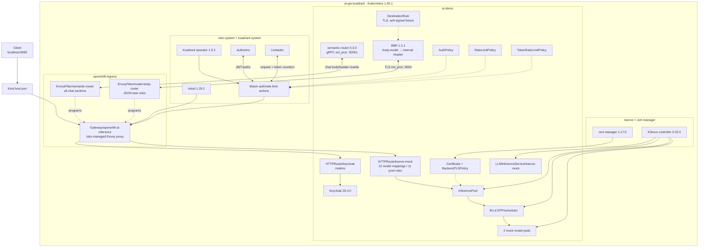
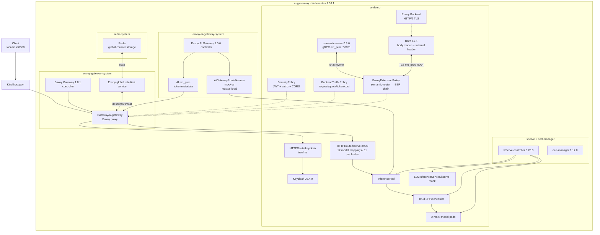
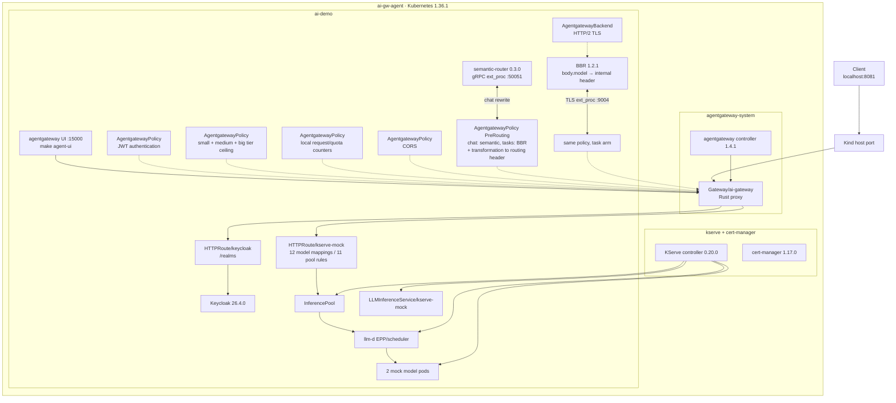

# KServe LLMInferenceService gateway comparison

This repository runs the same KServe inference path through three Gateway API
stacks:

```text
OpenAI body.model -> gateway BBR ext_proc -> HTTPRoute -> InferencePool
                  -> llm-d endpoint picker -> model pod
```

The default deployment is a deterministic CPU fixture for comparing routing,
OpenAI-compatible APIs, and gateway behavior on kind. An optional policy layer
adds Keycloak authentication, authorization, rate limits, and quotas, then
compares which paths can enforce token budgets and CORS. A separate production
package deploys real, task-specific vLLM services on NVIDIA GPUs.

Shared components are pinned once per cluster: KServe 0.20.0, Gateway API
Inference Extension BBR 1.2.1, and Keycloak 26.4.0. All Helm charts and CRD
schemas are vendored in the repository.

Clients send only the ordinary OpenAI JSON field, for example
`{"model":"kimi-k3",...}`. The official Body-Based Router (BBR) copies that
value into the internal `X-Gateway-Model-Name` header and clears the proxy's
route cache. A header-specific `HTTPRoute` rule then selects the model's KServe
pool, and that pool's llm-d endpoint picker selects a replica. BBR overwrites a
client-forged internal header; clients never choose an accelerator header.

[docs/inference-path-atlas.html](docs/inference-path-atlas.html) traces one chat
completion through all three stacks hop by hop -- every filter in the order it
actually runs, the object that put it there, and the header and body deltas,
read from `/config_dump` on the running proxies rather than from these
manifests. Open it in a browser; it is self-contained.

[docs/open-questions.md](docs/open-questions.md) lists the decisions this
repository has deferred -- places where the current behaviour was a side effect
rather than a choice, or where a gap could be closed and has not been. It is
separate from the comparison table, which records what each stack does.

## Gateway comparison

This is the canonical gateway comparison. Other tables in this README describe
models, APIs, accelerator pools, or deployment platforms—not differences
between the three gateways. It inventories the pinned APIs; it does not imply
that every row is exercised by the default KServe fixture. The evidence table
below separates live behavior from schema-only and path-limited capabilities.

| Comparison | OpenShift profile (Kuadrant) | Envoy AI Gateway | agentgateway |
|---|---|---|---|
| Pinned stack | Kuadrant 1.5.2, Istio 1.29.2, Envoy proxy | Envoy AI Gateway 1.0.0, Envoy Gateway 1.8.1 | agentgateway 1.4.1 |
| Local URL | <http://localhost:8082> | <http://localhost:8080> | <http://localhost:8081> |
| Data plane | Envoy managed by Istio | Envoy managed by Envoy Gateway | agentgateway Rust proxy |
| Gateway topology | OpenShift-aligned shared `Gateway/openshift-ai-inference` in `openshift-ingress` | `Gateway/ai-gateway` in `ai-demo` | `Gateway/ai-gateway` in `ai-demo` |
| JWT authentication | `AuthPolicy` `authentication.jwt` | `SecurityPolicy` `jwt.providers` | `AgentgatewayPolicy` `traffic.jwtAuthentication` |
| Browser OIDC | `OIDCPolicy` | `SecurityPolicy` `oidc` | MCP OAuth metadata and Keycloak preset |
| API keys | Secret-backed `AuthPolicy` `authentication.apiKey` | `SecurityPolicy` `apiKeyAuth` | `traffic.apiKeyAuthentication` |
| Client mTLS | `AuthPolicy` `authentication.x509` | `ClientTrafficPolicy` | `frontend.tls` |
| External authorization | `AuthPolicy` HTTP metadata, OPA, or SpiceDB | `SecurityPolicy` `extAuth` | `traffic.extAuth` |
| External processing (ext_proc) | No policy API; an Istio `EnvoyFilter` patches raw Envoy configuration | `EnvoyExtensionPolicy` `extProc` | `traffic.extProc` |
| Authorization rules | Pattern matching, CEL, or OPA Rego | Claim/header rules; first match wins | CEL `matchExpressions`; Allow, Deny, or Require |
| Request rate limits | `RateLimitPolicy` | `BackendTrafficPolicy`, local or global | `traffic.rateLimit`, local or global |
| Long quota windows | Any window through 24 hours in the same policy | Day, Month, or Year | Local mode stops at Hours; longer windows require global rate limiting |
| Token budgets | `TokenRateLimitPolicy` reads response `usage.total_tokens` | `llmRequestCosts` through the AI Gateway ext-proc | `unit: Tokens` requires an agentgateway AI backend with tokenization; unavailable on this generic KServe `InferencePool` |
| Counter storage | Limitador installed by the operator | External Redis and rate-limit service for global limits | In-process for local limits |
| Per-identity buckets | CEL counters are supported; this pinned Istio fixture uses shared probe buckets because Authorino identity metadata is not exposed to the 1.5.2 Wasm rate-limit action | Header descriptors | CEL descriptors in global mode; local mode is shared per proxy |
| Nested limit buckets (org/team/user) | One named limit per level, each with its own CEL `counters` — but nothing the caller cannot forge actually keys them here | One global rule per level; `shared: true` would span routes but silently disables the token budget, so buckets stay per-route | `local` takes no key and `conditional` is first-match-wins, so only `rateLimit.global` nests — needs an external rate-limit service |
| Group hierarchy in rules | Exact `incl`, or a CEL `predicate` over the path claim | Exact claim values only; no prefix or regex, so nesting needs a flattened claim | CEL `startsWith` over the group path claim |
| CORS | No Kuadrant CORS policy; not enabled in this Istio fixture | `SecurityPolicy` `cors` | `traffic.cors` |
| LLM request shaping | Not provided by the compared policy | `AIGatewayRoute` body/header mutation | Model aliases, prompt prepend/append, and caching |
| Prompt guardrails | Not provided by the compared policy | Not provided by the compared policy | `backend.ai.promptGuard` |
| Provider credentials | Not provided by the compared policy | `BackendSecurityPolicy` | Backend authentication on `AgentgatewayBackend` |
| MCP routing | Not provided by the compared policy | `MCPRoute` | Native MCP routing with OAuth |
| Telemetry controls | `TelemetryPolicy` metric labels | `EnvoyProxy` telemetry | `frontend.metrics`, tracing, and access logs |

### Live comparison

`make compare CLUSTER=<name>` measures one running cluster and writes one
ignored JSON fragment under `compare/results/`. `make comparison-summary`
requires all three fragments and replaces everything between the markers below
with their merged table. The workflow performs those steps sequentially and
commits the updated README. These are regression smoke tests against a
zero-delay Python runtime, not production performance benchmarks.

<!-- comparison-results:start -->

| Check | OpenShift profile (Kuadrant) | Envoy AI Gateway | agentgateway |
|---|---|---|---|
| Last isolated comparison (UTC) | 2026-08-27 22:50 (30 requests) | 2026-08-27 22:42 (30 requests) | 2026-08-27 22:44 (30 requests) |
| Gateway Programmed | Yes | Yes | Yes |
| `LLMInferenceService` Ready | Yes | Yes | Yes |
| Route Accepted / ResolvedRefs | Yes / Yes | Yes / Yes | Yes / Yes |
| Route rules | 12 body.model mappings / 11 pool rules | 12 body.model mappings / 11 pool rules | 12 body.model mappings / 11 pool rules |
| OpenAI `body.model` to accelerator pool | 4/4 pools; client headers overwritten | 4/4 pools; client headers overwritten | 4/4 pools; client headers overwritten |
| Endpoint-picker transport | TLS policy ready | Plaintext in local fixture | Plaintext in local fixture |
| Workload replicas | 2/2 | 2/2 | 2/2 |
| KServe-owned Deployments, Services, and Pool | 5 | 5 | 5 |
| Latest routing sample | 30/30 HTTP 200, 2 pods | 30/30 HTTP 200, 2 pods | 30/30 HTTP 200, 2 pods |
| Streaming usage chunk | Yes | Yes | Yes |
| Streaming `[DONE]` termination | Yes | Yes | Yes |
| Model catalog (`GET /v1/models`) | 19 models | 19 models | 19 models |
| Tiered chat models | big/medium/small | big/medium/small | big/medium/small |
| Embeddings API | Yes | Yes | Yes |
| RAG embedding models | Yes | Yes | Yes |
| Embedding dimension validation | 512 accepted / fixed-size rejected | 512 accepted / fixed-size rejected | 512 accepted / fixed-size rejected |
| Reranking API | Yes | Yes | Yes |
| Speech-to-text API | Yes | Yes | Yes |
| Speaker diarization | 3 speakers | 3 speakers | 3 speakers |
| Speech capability rejection | ASR-only diarization rejected | ASR-only diarization rejected | ASR-only diarization rejected |
| Negative API contracts | 404 / 400 / 400 / 400 / 400 | 404 / 400 / 400 / 400 / 400 | 404 / 400 / 400 / 400 / 400 |
| Local chat p50 | 44 ms | 44 ms | 52 ms |
| Policy objects reporting ready | 3/3 | 3/3 | 6/6 |
| Semantic router ext_proc attachment | Present, no status | Accepted | Accepted |
| Semantic router non-chat scope | 3/3 non-chat tasks bypassed | 3/3 non-chat tasks bypassed | 3/3 non-chat tasks bypassed |
| Auto model selection: reasoning / code / chat | kimi-k3 / deepseek-v4-flash / qwen3.8-27b | kimi-k3 / deepseek-v4-flash / qwen3.8-27b | kimi-k3 / deepseek-v4-flash / qwen3.8-27b |
| Model and prompt the runtime received | kimi-k3 / deepseek-v4-flash / qwen3.8-27b; system prompt 2/3 | kimi-k3 / deepseek-v4-flash / qwen3.8-27b; system prompt 2/3 | kimi-k3 / deepseek-v4-flash / qwen3.8-27b; system prompt 2/3 |
| Accelerator pools used by auto decisions | b300 / h200 / h100 | b300 / h200 / h100 | b300 / h200 / h100 |
| Decision headers returned to the client | big / medium / small | big / medium / small | big / medium / small |
| Auto-routed chat p50 | 31 ms | 21 ms | 13 ms |
| Semantic router unavailable | explicit 200 / auto 404 / restored | explicit 200 / auto 404 / restored | explicit 500 / auto 500 / restored |
| Keycloak token issuance | Yes | Yes | Yes |
| Authentication: anonymous / forged / valid | 401 / 401 / 200 | 401 / 401 / 200 | 401 / 401 / 200 |
| Authentication across models/chat/embed/rerank/STT | 5/5 denied / 5/5 allowed | 5/5 denied / 5/5 allowed | 5/5 denied / 5/5 allowed |
| Verified identity headers at model pod | x-auth-tier=big, x-auth-user=alice | x-auth-tier=big, x-user-id=alice | Not configured |
| Authorization: no tier / medium→big / big→big | 403 / 403 / 200 | 403 / 403 / 200 | 403 / 403 / 200 |
| Tier authorization: explicit big/medium/small tasks / auto tiers | medium ceiling 403/200/200/200; big ceiling 4/4; auto 403/200/200 | medium ceiling 403/200/200/200; big ceiling 4/4; auto 403/200/200 | medium ceiling 403/200/200/200; big ceiling 4/4; auto 403/200/200 |
| Tier ceiling: medium→big / big→big | medium 403 / big 200 | medium 403 / big 200 | medium 403 / big 200 |
| Tenant metadata cannot bypass tier | Denied by small tier (HTTP 403) | Denied by small tier (HTTP 403) | Denied by small tier (HTTP 403) |
| Request rate limit (5 per minute) | 429 on request 6 of 8 | 429 on request 6 of 8 | 429 on request 6 of 8 |
| Rate-limit bucket isolation | shared; Bob HTTP 429 | per-user; Bob HTTP 200 | shared; Bob HTTP 429 |
| Quota limit (3 per window) | 429 on request 4 of 6; shared bucket | 429 on request 4 of 6 | 429 on request 4 of 6; shared bucket |
| Nested org/team buckets (org 5, team 3) | unenforced: team A no 429 in 4; team B no 429 in 4; other org no 429 in 3 | nested: team A 429 on request 4 of 4; team B 429 on request 2 of 4; other org no 429 in 3 | Needs an external rate limit service |
| Forged tenant header | HONOURED -- bucket escaped (HTTP 200) | Ignored (HTTP 429) | Not applicable without tenant buckets |
| Tenant bucket across both routes | Single inference route | SEPARATE bucket per route -- ceiling doubled | Single inference route |
| Token limit (100 tokens per minute) | 429 on request 3 of 6 | 429 on request 3 of 6 | Not available on KServe InferencePool |
| CORS preflight answered | No (HTTP 405) | Yes (HTTP 200) | Yes (HTTP 200) |
| Unapproved CORS origin | No allow-origin (HTTP 405) | No allow-origin (HTTP 200) | No allow-origin (HTTP 200) |

<!-- comparison-results:end -->

Kuadrant is a policy control plane, not a proxy. The OpenShift profile combines
Kuadrant with Istio and Envoy to reproduce the OpenShift shared-Gateway shape;
it is an architectural analogue, not a Red Hat certification claim.

Three operational differences explain most of the matrix:

- Kuadrant includes Limitador, Envoy global rate limiting needs Redis and a
  rate-limit service, and agentgateway local limits live in each proxy.
- Daily quotas are native to Kuadrant and Envoy. agentgateway needs global mode
  for both long windows and identity-keyed buckets; its local demo uses Hours.
- Envoy token accounting runs through `AIGatewayRoute` ext-proc traffic. The
  repository therefore protects both that generated route and the ordinary
  `HTTPRoute`, and sends both to the same `InferencePool`.
- Kuadrant and Envoy enforce token budgets on the generic KServe path.
  agentgateway token units require its AI-backend tokenization metadata, which
  a Gateway API `InferencePool` does not publish.

### Feature evidence and untested surface

Evidence labels are deliberately strict:

- **Live**: exercised through the public gateway and the KServe
  `LLMInferenceService` path in the isolated run above.
- **Schema**: accepted by the pinned vendored CRD/schema, but no live fixture is
  installed for it.
- **Path-limited**: the gateway supports it, but it requires a different
  backend or protocol and cannot be honestly tested through the repository's
  single generic KServe `InferencePool` path.
- **Not provided**: the compared pinned API/profile does not supply it.

| Capability | OpenShift profile (Kuadrant) | Envoy AI Gateway | agentgateway | Evidence boundary |
|---|---|---|---|---|
| KServe route, EPP, two model pods | Live | Live | Live | Programmed/Accepted conditions, ownership, and 30/30 successful routing sample |
| OpenAI `body.model` to accelerator pool | Live | Live | Live | B300, H200, H100, and L40S plus a forged internal-header overwrite are probed |
| Models, chat/SSE, embeddings, rerank, STT | Live | Live | Live | Valid and invalid contracts, `[DONE]`, dimensions, and unsupported diarization |
| JWT and authorization | Live | Live | Live | Anonymous, forged, guest, member, and admin requests; all five APIs require a valid token |
| Identity export to the model | Live | Live | Not configured | Allowlisted non-secret evidence headers are echoed by the mock runtime |
| Request limits and quota threshold | Live, shared bucket | Live, per-user bucket | Live, shared local bucket | Limit threshold and Alice/Bob isolation are tested; full expiry windows are not waited out |
| Token budget on KServe path | Live | Live | Path-limited | agentgateway token units need an AI backend/tokenizer, not a generic `InferencePool` |
| CORS allow and reject | Not provided | Live | Live | Approved and unapproved origins are both probed |
| Chat-only external processing | Live, raw `EnvoyFilter` | Live | Live | Selection, response headers, non-chat bypass, fail-open, and restoration are tested |
| Endpoint-picker transport | Live TLS | Live plaintext fixture | Live plaintext fixture | Kuadrant additionally asserts `BackendTLSPolicy` readiness; this row describes EPP, not BBR |
| BBR transport | Live self-signed TLS | Live self-signed TLS | Live self-signed TLS | Istio `DestinationRule`, Envoy `Backend`, and `AgentgatewayBackend` originate HTTP/2 TLS |
| API-key authentication | Schema | Schema | Schema | Requires separate secrets and an authentication-composition test matrix |
| Browser OIDC | Schema | Schema | Path-limited to MCP OAuth | Requires redirects, callback URLs, browser state, and a separate listener/client fixture |
| Client mTLS | Schema | Schema | Schema | Requires an HTTPS listener plus client and trust-chain certificates |
| External authorization service | Schema | Schema | Schema | Requires a mock HTTP/gRPC/OPA/SpiceDB authorization service |
| LLM request shaping | Not provided | Path-limited to AI route/backend | Path-limited to AI backend | Generic KServe traffic intentionally remains provider-neutral |
| Prompt guardrails | Not provided | Not provided | Path-limited to AI backend | Needs agentgateway AI-backend prompt processing |
| Provider credentials | Not provided | Path-limited | Path-limited | Only meaningful for external provider backends, not the in-cluster KServe pool |
| MCP routing and OAuth | Not provided | Path-limited | Path-limited | Requires `MCPRoute`/MCP backends and a separate protocol test path |
| Telemetry export | Schema | Schema | Schema | No collector is installed and no metric/span/log delivery assertion is made |

The pinned vendored CRDs are the authority for **Schema** rows. Upstream
references are useful navigation but may describe a newer release:
[Envoy AI Gateway API](https://aigateway.envoyproxy.io/docs/api/),
[Envoy Gateway SecurityPolicy](https://gateway.envoyproxy.io/docs/concepts/gateway_api_extensions/security-policy/),
[agentgateway policy execution order](https://agentgateway.dev/docs/kubernetes/main/about/policies/filter-order/), and
[agentgateway API reference](https://agentgateway.dev/docs/kubernetes/latest/reference/api/).

Per gateway, the remaining live gaps are therefore explicit. Kuadrant does not
live-test `OIDCPolicy`, API keys, x509, HTTP/OPA/SpiceDB authorization, or
telemetry. Envoy does not live-test API keys, OIDC, mTLS, `extAuth`, provider
credentials, MCP, or AI-provider request mutation. agentgateway does not
live-test API keys, mTLS, `extAuth`, global keyed rate limiting, AI-backend
prompt guards/provider credentials, MCP OAuth, or telemetry. Those fixtures
would either replace a currently isolated authentication mechanism or add a
second non-KServe backend/protocol, so they are reported rather than silently
credited as tested.

## Quick start

Prerequisites: Docker, kind, kubectl, Helm, curl, and Python 3. Install the
offline validator dependency once with
`python3 -m pip install -r requirements-dev.txt`.

```bash
make up CLUSTER=ai-gw-kuadrant
make policies CLUSTER=ai-gw-kuadrant
make semantic-router CLUSTER=ai-gw-kuadrant
make compare CLUSTER=ai-gw-kuadrant
make stop-cluster CLUSTER=ai-gw-kuadrant
```

Repeat with `ai-gw-envoy` and `ai-gw-agent`, then merge the independently saved
results into the summary table:

```bash
make comparison-summary
```

Every ordinary lifecycle command targets exactly one cluster through the same
`CLUSTER` variable. The separate clusters prevent one installer from upgrading
another stack's cluster-scoped Gateway API or inference-extension CRDs.

The explicit all-cluster helpers perform the same work sequentially and leave
every cluster stopped:

```bash
make up-all
make features-all
make compare-all
```

`compare-all` starts and cold-start-checks one retained node, writes
`compare/results/<cluster>.json`, stops that node, and only then starts the next
one. After the third result it refreshes the comparison table in this README.

Useful single-cluster lifecycle commands:

```bash
make start-cluster CLUSTER=ai-gw-envoy
make status CLUSTER=ai-gw-envoy
make pools CLUSTER=ai-gw-envoy
make pools-down CLUSTER=ai-gw-envoy
make policies-down CLUSTER=ai-gw-envoy
make semantic-router-down CLUSTER=ai-gw-envoy
make stop-cluster CLUSTER=ai-gw-envoy
make down CLUSTER=ai-gw-envoy
```

Repository-wide commands that do not target a cluster:

```bash
make stop-clusters
make test
make validate
make agent-ui
make down-all
```

`make agent-ui` exposes the agentgateway UI at <http://localhost:15000/ui>.

Stopping a cluster only stops its Docker node container. It retains all
Kubernetes resources and images. `make down` is different: it deletes the
selected cluster; `make down-all` deletes all three.

On a retained Kuadrant cluster, `make start-cluster` also waits for the
operator's in-cluster Wasm server and then rolls the Istio gateway proxy once.
This prevents Envoy from caching a fail-closed Wasm download attempted before
the operator recovered. The other stacks need no equivalent proxy restart.
Because every Kind cluster has exactly one control-plane node, recovery also
disables scheduler and controller-manager leader election: there is no failover
candidate, and surrendering a lease during a transient Docker-resume API stall
otherwise leaves Deployments and ReplicaSets unreconciled. Polling reads have
bounded client timeouts and always reevaluate current pods rather than watching
stale ReplicaSet members.

## Deployment dependencies and versions

The automated path requires Docker, kind, kubectl, Helm, curl, Python 3 with
the packages in `requirements-dev.txt`, and outbound access during first
installation for CRD manifests and container images. The controller charts are
vendored, but their images still have to be present or pullable. Each Kind
cluster is a single Kubernetes 1.36.1 node.

| Layer | Shared or stack-specific dependency | Pinned version |
|---|---|---|
| Kubernetes | One independent Kind cluster per gateway | 1.36.1 (`kindest/node` digest pinned) |
| Gateway API Inference Extension | Required before gateway and KServe controllers | 1.5.0 |
| Body-Based Router | JSON `body.model` to the internal Gateway API model header | 1.2.1 |
| KServe LLMInferenceService | Shared inference controller in each cluster | 0.20.0 |
| cert-manager | KServe webhooks; also endpoint-picker TLS in the OpenShift profile | 1.17.0 |
| Identity | Keycloak realm imported independently in each cluster | 26.4.0 |
| OpenShift profile | Gateway API 1.4.1, Istio, then Kuadrant | Istio 1.29.2; Kuadrant 1.5.2 |
| Envoy path | Envoy Gateway, then Envoy AI Gateway | 1.8.1; 1.0.0 |
| agentgateway path | Gateway API 1.6.0, then agentgateway | 1.4.1 |
| Optional semantic router | Runs after the KServe route exists | 0.3.0 |

Install order is enforced independently for each cluster: Kind node and CRDs →
selected gateway controller → KServe controller → mock runtime ConfigMap →
Gateway → `LLMInferenceService`, BBR, and route → optional Keycloak policies →
optional semantic router. The Envoy policy installer also corrects the
vendored Envoy Gateway 1.8.1 `BackendTrafficPolicy` int32 schema maximum before
applying limits.

BBR 1.2.1 always generates an ephemeral self-signed serving certificate. The
local fixture therefore enables upstream TLS but skips certificate verification:
Istio uses `DestinationRule`, Envoy Gateway uses a typed `Backend`, and
agentgateway uses `AgentgatewayBackend`. This is suitable for an isolated Kind
comparison only. A production deployment should use a BBR build/configuration
with an operator-controlled certificate and verify its CA/SAN instead.

## Architecture

Each schema below is one complete Kind cluster. All three contain the same
KServe desired state—one base `LLMInferenceService`, its scheduler/EPP,
`InferencePool`, two CPU model pods, BBR, Keycloak, and the optional semantic
router. `make pools` adds four accelerator-class LLMIs in that same cluster;
no component is shared across clusters.

### OpenShift profile: Kuadrant + Istio/Envoy



| Specification | Value |
|---|---|
| Cluster / context | `ai-gw-kuadrant` / `kind-ai-gw-kuadrant` |
| Public endpoint | `http://localhost:8082`; one OpenShift-style shared Gateway in `openshift-ingress` |
| Control/data plane | Kuadrant 1.5.2 and Istio 1.29.2 program an Envoy gateway proxy |
| Gateway API versions | Gateway API 1.4.1; Inference Extension 1.5.0 |
| Security | Keycloak JWT plus big-tier authorization through `AuthPolicy` and Authorino |
| Limits | Limitador-backed request, quota, and response `usage.total_tokens` accounting; fixture probe buckets are shared |
| Model-to-pool routing | Raw Istio `EnvoyFilter` runs BBR only on named JSON task/model rules; a TLS `DestinationRule` handles BBR's runtime self-signed certificate |
| Semantic routing | A preceding raw `EnvoyFilter` covers the base chat rule and all five model-specific chat rules; BBR then recomputes the route, so `auto` reaches B300/H200/H100 even when a client forges the internal model header |
| KServe connection | body-derived route rule → `InferencePool` → TLS-protected EPP → model pods |
| Deep live evidence | 30-request routing sample; four body-routed pools; five APIs; JWT/authz/identity; shared rate/quota; token budget; ext_proc scope/fail-open; EPP TLS |
| Not provided in this profile | Native Kuadrant CORS or ext_proc policy; CORS probe returns HTTP 405 |

This profile's Kustomize overlays change the route parent to
`openshift-ingress/openshift-ai-inference` and add the trusted endpoint-picker
certificate topology used to approximate OpenShift AI closely on Kind.

### Envoy AI Gateway



| Specification | Value |
|---|---|
| Cluster / context | `ai-gw-envoy` / `kind-ai-gw-envoy` |
| Public endpoint | `http://localhost:8080`; `Gateway/ai-gateway` in `ai-demo` |
| Control/data plane | Envoy Gateway 1.8.1 plus Envoy AI Gateway 1.0.0 program an Envoy proxy |
| Gateway API versions | Inference Extension 1.5.0; Envoy Gateway supplies its Gateway API CRDs |
| Security | `SecurityPolicy` verifies Keycloak JWT, exports user/tier headers, applies tier-ceiling authorization and CORS |
| Limits | `BackendTrafficPolicy` global limits; Envoy rate-limit service stores keyed counters in Redis |
| Token path | `Host: ai.local` uses `AIGatewayRoute`; AI ext_proc publishes `llm_total_token` consumed as response cost |
| Model-to-pool routing | `EnvoyExtensionPolicy` calls BBR through a typed HTTP/2 TLS `Backend`; base and model sections are both covered against header spoofing |
| Semantic routing | One ordered policy runs semantic-router then BBR, so explicit and `auto` models reach their accelerator pools; non-chat tasks bypass semantic routing |
| KServe connection | Body-derived and AI-generated HTTP routes end at KServe `InferencePool` resources and their EPPs |
| Deep live evidence | 30-request routing sample; four body-routed pools; five APIs; JWT/authz/identity; per-user rate/quota; token budget; CORS allow/reject; ext_proc scope/fail-open |
| Installer compatibility fix | Clamps the invalid uint32 maximum in the 1.8.1 int32 `BackendTrafficPolicy` CRD |

### agentgateway



| Specification | Value |
|---|---|
| Cluster / context | `ai-gw-agent` / `kind-ai-gw-agent` |
| Public endpoint | `http://localhost:8081`; UI through `make agent-ui` at `http://localhost:15000/ui` |
| Control/data plane | agentgateway 1.4.1 controller and Rust proxy |
| Gateway API versions | Gateway API 1.6.0; Inference Extension 1.5.0 |
| Security | Separate `AgentgatewayPolicy` resources for Keycloak JWT, small/medium/big tier ceilings, and CORS |
| Limits | In-process local request/minute and quota/hour counters, shared per proxy; global mode is required for durable keyed windows |
| Token boundary | Generic KServe `InferencePool` does not publish agentgateway AI-backend tokenization metadata, so token units are reported unavailable |
| Model-to-pool routing | Gateway-scoped PreRouting BBR uses a native `AgentgatewayBackend` with HTTP/2 TLS and handles chat, embedding, and rerank JSON bodies; with the semantic router installed it keeps the task paths and the router takes chat |
| Semantic routing | Route-scoped semantic ext_proc runs after PreRouting BBR in v1.4.1: selection works, but `auto` stays on shared pool `all`; explicit models reach accelerator pools |
| KServe connection | Body-derived route rule → KServe `InferencePool` → EPP → model pods |
| Deep live evidence | 30-request routing sample; four explicit body-routed pools; five APIs; JWT/authz; shared local rate/quota; CORS allow/reject; ext_proc scope/fail-open |
| Additional native surface | AI backends, prompt guards, model aliases/caching, MCP routing/OAuth, tracing, metrics, and access logs |

## Runtime profiles

### CPU mock fixture

The default `LLMInferenceService` has two Python replicas. Storage
initialization is disabled and `mock-llm/server.py` is mounted from a ConfigMap.
The runtime loads no weights and contacts no model provider. It also exposes a
small Prometheus `/metrics` surface with vLLM-compatible running, waiting, and
cache gauges so the llm-d scheduler can scrape it without filling logs with
404s during retained-cluster recovery.

It exposes the API subset used by the production vLLM validator:

| Capability | Endpoint | Contract |
|---|---|---|
| Models | `GET /v1/models`, `GET /v1/models/{id}` | OpenAI model objects plus fixture task, tier, and placement metadata |
| Chat | `POST /v1/chat/completions` | OpenAI JSON and SSE; usage is included in streams only when requested |
| Embeddings | `POST /v1/embeddings` | OpenAI list response for string or string-array input |
| Reranking | `POST /rerank`, `/v1/rerank`, `/v2/rerank` | vLLM query/documents schema; documents are returned only with `return_documents: true` |
| Transcription | `POST /v1/audio/transcriptions` | OpenAI multipart file, model, and response format |

The mock adds `mock_*` observability fields. Its `diarization` and
`num_speakers` transcription fields are fixture extensions and are not part of
the shared vLLM contract.

Try the same requests through any local gateway URL:

```bash
BASE=http://localhost:8082

curl "$BASE/v1/chat/completions" \
  -H 'content-type: application/json' \
  -d '{"model":"mock-kserve","messages":[{"role":"user","content":"hello"}]}'

curl "$BASE/v1/embeddings" \
  -H 'content-type: application/json' \
  -d '{"model":"mock-embedding","input":["gateway inference","KServe routing"]}'

curl "$BASE/v1/rerank" \
  -H 'content-type: application/json' \
  -d '{"model":"mock-reranker","query":"gateway inference","documents":["unrelated","gateway inference routing"],"top_n":1,"return_documents":true}'

curl "$BASE/v1/audio/transcriptions" \
  -F 'file=@sample.wav;type=audio/wav' \
  -F 'model=mock-whisper'
```

#### Mock model catalog

Every identifier below is a fixture. Unknown models return HTTP 404
`model_not_found`; models sent to the wrong task return HTTP 400.

The canonical authorization contract is: B300 models are `big`, the H200
model is `medium`, and every H100 or L40S model is `small`. CPU-only fixture
models are also `small`. Task type never promotes a model to another tier.

| Model | Task | Tier | Placement | Relevant limits/features |
|---|---|---|---|---|
| `kimi-k3` | Chat | Big | B300 | 262144 context, 16384 output |
| `glm-5.3` | Chat | Big | B300 | 204800 context, 16384 output |
| `deepseek-v4-pro` | Chat | Big | B300 | 163840 context, 32768 output |
| `deepseek-v4-flash` | Chat | Medium | H200 | 131072 context, 8192 output |
| `qwen3.8-27b` | Chat | Small | H100 | 65536 context, 8192 output |
| `mock-kserve` | Chat | Small | CPU | 8192 context, 1024 output |
| `qwen3-embedding-8b` | Embedding | Small | H100 | 4096 dimensions, Matryoshka |
| `e5-mistral-7b-instruct` | Embedding | Small | H100 | 4096 dimensions |
| `bge-m3` | Embedding | Small | L40S | 1024 dimensions |
| `jina-embeddings-v3` | Embedding | Small | L40S | 1024 dimensions, Matryoshka |
| `nomic-embed-text-v2-moe` | Embedding | Small | L40S | 768 dimensions, Matryoshka |
| `mock-embedding` | Embedding | Small | CPU | 8 dimensions |
| `bge-reranker-v2-m3` | Rerank | Small | L40S | 256 documents |
| `jina-reranker-v2-base-multilingual` | Rerank | Small | L40S | 128 documents |
| `mock-reranker` | Rerank | Small | CPU | 64 documents |
| `whisper-large-v3` | Transcription | Small | L40S | ASR, timestamps, mock diarization up to 8 speakers |
| `voxtral-small-24b` | Transcription | Small | H100 | ASR, timestamps, mock diarization up to 8 speakers |
| `voxtral-mini-3b` | Transcription | Small | L40S | ASR and timestamps; no diarization |
| `mock-whisper` | Transcription | Small | CPU | ASR, timestamps, mock diarization up to 4 speakers |

Chat responses expose the selected tier through `mock_tier`, message content,
and deterministic completion usage. Matryoshka embedding fixtures accept a
smaller `dimensions` value; other embedding fixtures reject it.

#### Accelerator routing fixture

`make pools CLUSTER=<name>` adds one mock serving pool per intended accelerator
class. These resources validate placement, body-derived routing, pool
ownership, and wrong-pool errors on kind; they do not turn the Python container
into a GPU model server.

| Pool | Intended accelerator | Models |
|---|---|---|
| `kserve-b300` | NVIDIA B300 | `kimi-k3`, `glm-5.3`, `deepseek-v4-pro` |
| `kserve-h200` | NVIDIA H200 | `deepseek-v4-flash` |
| `kserve-h100` | NVIDIA H100 | `qwen3.8-27b`, both large embedding models, `voxtral-small-24b` |
| `kserve-l40s` | NVIDIA L40S | Light embeddings, both rerankers, `whisper-large-v3`, `voxtral-mini-3b` |
| `kserve-mock` | CPU | The four `mock-*` task fixtures |

The client selects a model exactly as it would with any OpenAI-compatible API.
There is no routing header:

```bash
curl "$BASE/v1/chat/completions" \
  -H 'content-type: application/json' \
  -d '{"model":"kimi-k3","messages":[{"role":"user","content":"hello"}]}'
```

BBR derives the internal routing header from `body.model`; named HTTPRoute
rules map it to `kserve-b300`, `kserve-h200`, `kserve-h100`, or `kserve-l40s`.
The deployment probe also sends a contradictory internal header and verifies
that BBR's body value wins. `mock_accelerator` reports the runtime that actually
answered; the shared fixture reports `all`. `model_accelerator` reports the
model's intended class. A model sent to the wrong pool returns HTTP 404
`model_not_served_here`.

BBR 1.2.1 parses JSON. Chat, embedding, and rerank requests therefore use
body-based pool routing. OpenAI speech-to-text is multipart, so its `model`
form field cannot be extracted by this BBR release and remains on a dedicated
shared-fixture route section. Every transcription model is small-tier, so the
ordinary small-tier ceiling policy is sufficient for that section.

### Production vLLM

Each gateway-local `deploy/kserve/production/` directory contains the same
replacement for the combined fixture: one independently scalable vLLM
`LLMInferenceService` per model and task. The top-level `kserve/production/`
keeps the same package available to arbitrary external GPU contexts.

| Public endpoint | Hugging Face model | Served name | Tier | API | Reference GPU |
|---|---|---|---|---|---|
| `/v1/chat/completions`, `/v1/models` | `Qwen/Qwen3.8-27B` | `qwen3.8-27b` (`auto` alias) | Small | Chat and models | H100 |
| `/v1/embeddings` | `Qwen/Qwen3-Embedding-8B` | `qwen3-embedding-8b` | Small | Embeddings | H100 |
| `/rerank`, `/v1/rerank`, `/v2/rerank` | `BAAI/bge-reranker-v2-m3` | `bge-reranker-v2-m3` | Small | Rerank | L40S |
| `/v1/audio/transcriptions` | `openai/whisper-large-v3` | `whisper-large-v3` | Small | Transcription | L40S |

The shared runtime config uses the official pinned
[`vllm/vllm-openai:v0.27.0` image](https://docs.vllm.ai/en/v0.27.0/deployment/docker/),
`/health` probes, in-memory `/dev/shm`, writable vLLM/Hugging Face caches,
non-root UID 2000, equal GPU requests and limits, KServe storage
initialization, and the same `InferencePool`/endpoint-picker data path as the
mock. Version 0.27.0 includes the fix for
[GHSA-7m6h-x95x-82q5](https://github.com/vllm-project/vllm/security/advisories/GHSA-7m6h-x95x-82q5).

Deploy to a KServe 0.20 cluster with NVIDIA GPU nodes and an existing
`ai-demo/ai-gateway`. On the three repository-owned contexts, reconcile
`make policies CLUSTER=<name>` first; the deployment refuses to create open
production routes and installs fixed-tier native policies with them:

```bash
make vllm-production VLLM_CONTEXT=my-gpu-context
make vllm-validate VLLM_BASE_URL=https://gateway.example.com VLLM_TOKEN="$TOKEN"
make vllm-production-down VLLM_CONTEXT=my-gpu-context
```

The deploy script fails before mutation if no node advertises allocatable
`nvidia.com/gpu`. GPU labels, model sizes, credentials, storage, and replica
counts are reference defaults and should be overlaid for the target cluster.

## Gateway policy test layer

`make up CLUSTER=<name>` leaves that cluster's `/v1` path open so routing can be
tested without credentials. `make policies CLUSTER=<name>` installs Keycloak
and the selected gateway's native policy resources against its `HTTPRoute` and
`InferencePool`.

The common behavior is:

- valid Keycloak access token required; anonymous and forged tokens get 401;
- one scalar Keycloak `tier` claim controls all model authorization: `big`
  reaches every tier, `medium` reaches medium and small, and `small` reaches
  small only; org/team never grant model access;
- equivalent opt-in request and quota probes.

The stack-specific edges are intentional and recorded in the live table:

- Kuadrant and Envoy enforce 100 LLM tokens per minute from response usage;
  agentgateway reports the token probe unavailable on a generic KServe
  `InferencePool` because token units require its AI-backend tokenization;
- Envoy and agentgateway answer CORS preflight for
  `https://console.example.com`; this Kuadrant/Istio profile has no native
  Kuadrant CORS policy and returns HTTP 405;
- the pinned Kuadrant profile uses shared opt-in rate/quota/token buckets. The
  product API supports authenticated CEL counters, but Authorino identity
  metadata is not exposed to the rate-limit action in this local 1.5.2 Wasm
  topology. Envoy uses per-user descriptors, while agentgateway local mode is
  shared per proxy.

Probe headers isolate rate-limit tests from ordinary traffic:
`x-rate-limit-probe`, `x-quota-probe`, `x-token-limit-probe`, and
`x-tenant-probe`. Envoy uses the quota probe value as a fresh key. Kuadrant and
agentgateway use shared buckets for the first three, which the comparison
output labels explicitly. The tenant probe carries one value per run shared by
every probe user, so the org bucket they are meant to contend for is the same
bucket.

### Test identities

Each cluster exposes its own `ai-gateway` Keycloak realm through the same
gateway endpoint as inference traffic.

| User | Password | Tier ceiling | Tenant path | Expected model access |
|---|---|---|---|---|
| `alice` | `alice` | Big | — | Big, medium, small |
| `bob` | `bob` | Medium | — | Medium, small |
| `mallory` | `mallory` | None | — | HTTP 403 on `/v1` |
| `carol` | `carol` | Big | `/acme/research` | Big, medium, small |
| `dave` | `dave` | Medium | `/acme/support` | Medium, small |
| `erin` | `erin` | Small | `/globex/platform` | Small only |
| `frank` | `frank` | Small | `/globex/research` | Small only |

```bash
BASE=http://localhost:8082
TOKEN=$(curl -sS "$BASE/realms/ai-gateway/protocol/openid-connect/token" \
  -d grant_type=password -d client_id=ai-gateway-cli \
  -d username=alice -d password=alice |
  python3 -c 'import json,sys; print(json.load(sys.stdin)["access_token"])')

curl "$BASE/v1/chat/completions" \
  -H "authorization: Bearer $TOKEN" \
  -H 'content-type: application/json' \
  -d '{"model":"mock-kserve","messages":[{"role":"user","content":"hello"}]}'
```

### Multi-level tenancy: org, team, user

The first three identities above are flat. `carol`, `dave` and `erin` add a
second axis: nested Keycloak groups (`/acme/research`, `/acme/support`,
`/globex/platform`) used only to test org/team/user rate-limit isolation.

**Identity.** The realm emits the hierarchy twice, and it has to. Keycloak's
group membership claim carries the paths a user is *directly* in — a member of
`/acme/research` gets `["/acme/research"]`, not its ancestors — so asking "is
this caller anywhere under `/acme`" is a prefix test. agentgateway does that
natively, since its rules are CEL, and Kuadrant can through an Authorino CEL
`predicate`. Envoy Gateway cannot: it matches claims by exact value only, no
prefix and no regex. So a second pair of scalar claims, `org` and `team`,
carries the same fact in a flattened form. Those claims are also what keys the
limit buckets in every stack, since a rate-limit descriptor cannot key on an
array.

Model authorization does not read group paths, org, or team. It reads only the
scalar `tier` claim. The comparison deliberately sends Frank's small-tier token
from `/globex/research` to a big model to prove tenant metadata cannot widen
the tier ceiling.

**Limits** nest by intersection: org, team and user counters are all charged
for the same request, and whichever empties first returns the 429. Team caps
are over-subscribed against the org cap on purpose — the parent is the real
ceiling, and the child only stops one team eating it alone.

Each stack reaches this differently, and one cannot:

- **Envoy AI Gateway** — one global rate-limit rule per level, keyed
  `type: Distinct`. Nesting works, and it comes with a trade-off that only a
  live run surfaces. `shared: true` is the setting that makes a tenant bucket
  span both inference routes; without it the policy targets the Gateway, each
  route keeps its own counters, and an org gets one full budget per route.
  But setting it on *any* rule in the policy makes Envoy Gateway emit a second
  rate-limit filter with its own domain, and the limit service registers every
  limit under one domain only. Request-phase limits survive that — the
  decision is the OR of the two filters. The token budget does not: it is
  charged with `apply_on_stream_done`, that call lands on the empty domain,
  and the budget silently stops being enforced (measured: 8 × 57 tokens
  against a 100/minute cap, no 429, while the request-count rules kept
  working). The policy therefore leaves the flag off and takes the doubled
  ceiling, which is the failure the comparison can see: the tenant-bucket row
  reports `SEPARATE bucket per route — ceiling doubled`.
- **Kuadrant** — one named limit per level with its own CEL `counters`, and
  here it does not work. Three keyings were measured: `auth.identity.org`
  is unenforced, confirming that Authorino's identity metadata is not exposed
  to the rate-limit action in the pinned Wasm topology; the headers the
  `AuthPolicy` injects are *also* unenforced, because they are added toward
  the upstream and are not in `request.headers` when the action evaluates, so
  the descriptor is absent and the limit is skipped; and a client-supplied
  `x-org-id` does bind, which makes it forgeable rather than a tenancy
  control. The nesting row reads `unenforced` and the limits stay unpromoted.

  Quoting matters more than it looks here. Kuadrant interpolates a counter
  expression into a CEL string for Limitador's `variables`, so
  `request.headers["x"]` becomes `descriptors[0]["request.headers["x"]"]`,
  whose inner quotes end the string early. Limitador rejects the *entire*
  limit file over it and crash-loops on a cold start, taking every rate limit
  in the policy with it — while the `RateLimitPolicy` still reports
  `Enforced: True`. Use single quotes; `make validate` rejects a double one.
- **agentgateway** — not expressible with what is deployed. A `local` bucket
  takes no key at all, and while the `conditional` wrapper does take CEL, only
  "the first matching policy will be executed" — first-match-wins cannot charge
  an org bucket and a team bucket for one request. `rateLimit.global` nests
  cleanly and handles token cost natively, but requires an external rate-limit
  service this repository deploys for Envoy Gateway only. A deployment gap
  rather than a capability gap.

**Spoofing.** Once a bucket is keyed on `x-org-id`, a caller who can set that
header picks their own budget. The comparison forges one against an exhausted
org bucket: if the value is honoured the request escapes into another tenant's
allowance, and the row says so.

`scripts/validate-tenant-model.py` (part of `make validate`) holds the pieces
together offline — the probe users exist and are password-grantable, two share
an org and one does not, the caps in both stacks agree with the caps the
harness classifies against, the caps are spaced so the three outcomes stay
distinguishable, `shared: true` stays off the Envoy tenant rules for as long as
that policy also charges a response cost, and no Kuadrant counter expression
carries the double quote that crash-loops Limitador.

## Semantic routing layer

`make semantic-router CLUSTER=<name>` puts the [vLLM Semantic
Router](https://github.com/vllm-project/semantic-router) in front of the same
KServe path, as each gateway's external processor. It is the upstream release
image, `ghcr.io/vllm-project/semantic-router/extproc:v0.3.0`, deployed
identically in all three clusters; only the attachment differs, and that is
what this layer compares.

An attachment object exists before the proxy is using it, so the deployment
command waits for the selected policy to report `Accepted` where that API has a
status. `make compare CLUSTER=<name>` then tests an actual `auto` rewrite—the
only propagation check that also covers Kuadrant's status-less `EnvoyFilter`.
A gateway that never starts routing records the negative in its own result.

This layer's manifests and decisions pass the offline checks below and the
2026-08-26 isolated retest selected the expected reasoning, code, and chat
model through all three gateways. Run `make semantic-router-all && make
compare-all`, or dispatch the comparison workflow, to refresh every routing
detail and latency row together without running the clusters concurrently.

A request that names a model is forwarded unchanged, so every other row in the
comparison is unaffected. A request whose model is `auto` is resolved by the
router: it reads the prompt, rewrites the body's `model` field, replaces the
system prompt, and names its choice upstream in `x-selected-model`. The gateway
then routes the rewritten request down the ordinary `HTTPRoute` and
`InferencePool`, so the decision is visible in the answer itself.

The decision is reported in both directions, and the comparison measures each
separately. Upstream, the runtime reports the model and system prompt it was
handed, which is what proves the rewrite survived the gateway. Downstream, the
router adds `x-vsr-selected-decision`, `x-vsr-selected-reasoning`, and related
headers to the response, which is what proves the gateway propagates an
external processor's response-header mutations back to the client.

```bash
BASE=http://localhost:8082
curl "$BASE/v1/chat/completions" -H 'content-type: application/json' \
  -d '{"model":"auto","messages":[{"role":"user","content":"prove that the square root of two is irrational"}]}'

# -> "model": "kimi-k3", "mock_tier": "big"
```

| Prompt | Decision | Selected model | Tier |
|---|---|---|---|
| Proofs, derivations, step-by-step quantitative work | `big` | `kimi-k3` | Big, B300 |
| Programming, debugging, refactoring | `medium` | `deepseek-v4-flash` | Medium, H200 |
| Greetings and short conversational turns | `small` | `qwen3.8-27b` | Small, H100 |
| No decision matched | Default | `qwen3.8-27b` | Small, H100 |

### How each gateway attaches it

| Stack | Attachment | Status to check |
|---|---|---|
| OpenShift profile | Istio `EnvoyFilter` inserting `envoy.filters.http.ext_proc` into the gateway listener | None; `EnvoyFilter` has no status |
| Envoy AI Gateway | `EnvoyExtensionPolicy` `extProc` targeting the `HTTPRoute` | `Accepted` |
| agentgateway | `AgentgatewayPolicy` `traffic.extProc` in `PreRouting`, replacing the base BBR policy | `Accepted` |

Pool routing adds a second external processor. On Kuadrant and Envoy it runs
after semantic selection, so `model:auto` is converted to the selected model
and then reaches that model's pool. Because Envoy chooses an initial route
before either processor runs, both attachments enable semantic processing on
the base chat section and every model-specific chat section. The comparison
also sends `model:auto` with a contradictory internal header and requires the
semantic decision to win.

agentgateway reaches the same result by a different route, because it cannot
chain two processors. `traffic.extProc` is a single object -- one `backendRef`,
or a `conditional` list the CRD defines as first-match-wins -- and a second
policy setting the same field merges field-level and replaces the first rather
than chaining. Both policies still report `Accepted` and `Attached`; the loser
simply never runs. So the semantic attachment takes the pre-routing slot for
chat, leaves BBR on the JSON task paths, and hands its choice to the route
table through a `transformation` that copies `x-selected-model` into
`x-gateway-model-name`. Within `PreRouting`, `extProc` runs before
`transformation`, which is what makes that copy see a header the processor just
set.

The OpenShift profile is the outlier: Kuadrant has no external-processing
policy and Istio's Gateway API support does not cover ext_proc either, so the
filter is written in Envoy's own field names and patched into the listener,
with no controller status to confirm it was accepted. A `DestinationRule`
disables mesh mTLS toward the router, which otherwise fails the handshake — and
because the filter fails open, would leave every request silently unrouted. Two of the three attachments fail open by design: a router that is down leaves
inference working with the client's original model. agentgateway is the
exception, and not by preference. There the router owns the pre-routing slot,
so it resolves the model name that selects the pool *and* that the tier-ceiling
authorization rule reads; a fail-open outage leaves no filter able to name the
model. Measured with the router scaled to zero, `FailOpen` served an
a medium-tier caller the big-tier model it asked for, while explicit chat kept
working. `FailClosed` costs the availability instead, and the
`Semantic router unavailable` row reports the difference rather than hiding
it: `explicit 500 / auto 500` against `explicit 200 / auto 404` elsewhere.

### Decisions are keyword rules, not the classifier

[the gateway-local router configuration](kuadrant/deploy/semantic-router/router-config.yaml)
matches decisions with keyword rules, which are regular expressions evaluated
in-process. That is a deliberate fixture choice with two consequences: the
router downloads no model weights, so the pod requests 256 MiB and starts
without waiting on HuggingFace, and the same prompt yields the same decision on
every run — which is what makes the comparison row meaningful. The same file is
repeated under all three gateway deployment trees, and validation requires the
copies to remain byte-identical.

Real intent classification uses `domain` conditions instead, backed by the MoM
classifier models the router fetches from HuggingFace at startup. That profile
needs roughly 3 GiB of memory and a 10 GiB volume per cluster, and its first
start waits on the download, so it is not what the three-cluster comparison
runs. To use it, replace each decision's `keyword` condition with a `domain`
condition, declare the domains under `routing.signals.domains`, and raise the
Deployment's resources accordingly; the upstream
[Helm chart](https://github.com/vllm-project/semantic-router/tree/main/deploy/helm/semantic-router)
carries a complete example.

## OpenShift versus open-source KServe

Do not install upstream KServe and the OpenShift AI-managed distribution in
the same cluster.

| Condition | Automated kind reference | Red Hat OpenShift AI guidance |
|---|---|---|
| Purpose | Local gateway and API comparison | OpenShift-managed model serving |
| Platform | kind, Kubernetes 1.36.1 | OpenShift Container Platform 4.19.9 or later for the referenced distributed-inference procedure |
| KServe | Upstream 0.20.0 installed by this repository | Managed by the installed Red Hat OpenShift AI release; stable 3.4 includes KServe 0.17.0 |
| OpenShift AI release | Not installed | Stable supported reference: 3.4; the 3.5 distributed-inference documentation is Early Access as of 2026-08-25 |
| LLM API | `serving.kserve.io/v1alpha2` | Use the version installed by the selected OpenShift AI release; currently documented as `v1alpha1` |
| Gateway | Repository installs each GatewayClass and Gateway | Pre-existing GatewayClass and `openshift-ingress/openshift-ai-inference` |
| Runtime | CPU fixture by default; optional production vLLM package | Enabled OpenShift AI serving runtime, normally vLLM for LLMs |
| Installation | `make up CLUSTER=<name>` | Configure OpenShift AI; do not run `scripts/install-kserve.sh` |
| Validation here | Automated | Compatibility guidance only |

The automated path also installs Gateway API and Inference Extension CRDs and
cert-manager 1.17.0. It requires no GPU, model download, or object store.

Red Hat's current supported-configurations matrix lists OpenShift AI 3.4 on
OpenShift 4.19.9+, 4.20, 4.21, and 4.22. The separate OpenShift AI 3.5 llm-d
procedure says 4.19.9 or later, but 3.5 is still presented as Early Access.
Check the matrix for the exact supported pairing before a production install;
this repository is a behavioral reproduction, not a support statement.

For the OpenShift AI distributed-inference path:

- OpenShift Service Mesh v2 must not be installed for this topology;
- bare-metal clusters need an external Gateway Service entry point such as
  MetalLB;
- authentication must protect the inference endpoint;
- LeaderWorkerSet is optional normally and required when tensor, pipeline, or
  data parallelism spans more than eight accelerators;
- use the API version, storage, security context, runtime, and accelerator
  configuration supplied by the installed OpenShift AI release.

The OpenShift profile in this repository preserves the shared Gateway name,
namespace, cross-namespace route attachment, Kuadrant policy shape, and trusted
endpoint-picker TLS topology. Istio stands in for the OpenShift Gateway
controller because the Ingress Operator is unavailable on kind.

## Validation

Run all local runtime and manifest checks:

```bash
make test
make validate
```

`make test` includes the shared contract validator for model listing, chat,
streaming usage, embeddings, reranking, and WAV transcription. `make validate`
checks repository manifests against vendored structural CRD schemas and reports
unknown fields, wrong types, invalid enum values, and missing required fields.

The router's decisions are a ConfigMap, so no CRD schema covers them.
`make validate` therefore also checks them against the catalog they route to:
every selectable model is a chat model the runtime serves, every decision
resolves to exactly one keyword rule at a distinct priority, and the three
prompts the per-gateway comparison sends select three different models—read
from `compare/run-gateway.py` itself, so a changed prompt or keyword fails the
check rather than quietly reporting the default as a routing decision.

The org/team tenancy contract is checked the same way and for the same reason.
Its comparison row is a classifier rather than a threshold — it decides between
"nested", "shared" and "unenforced" by *which* request number returns 429 — so
a cap edited in one policy file and not the other does not fail loudly; the
gateway still behaves correctly and the row just relabels it "unexpected".
`make validate` therefore checks that the probe users exist and are
password-grantable, that two of them share an org and one does not, that both
stacks' caps agree with the caps the harness classifies against, that those
caps stay far enough apart for the three outcomes to be distinguishable, that
`shared: true` stays off the Envoy tenant rules while that policy also charges
a response cost — the flag silently disables the token budget — and that no
Kuadrant counter expression carries a double quote, which would make Limitador
reject its whole limit file and crash-loop.

`make compare CLUSTER=<name>` adds live-cluster assertions to that gateway's
saved result:

- Gateway Programmed, the expanded body-model route rules,
  Accepted/ResolvedRefs conditions, KServe readiness/ownership,
  endpoint-picker transport, and both model pods;
- model catalog, tier-correct routing, streaming usage and `[DONE]`, embeddings
  including reduced/fixed dimensions, reranking, transcription, and
  diarization capability rejection;
- negative API contracts for unknown model, wrong task, excessive output,
  fixed embedding dimensions, and unsupported diarization;
- p50 local request latency;
- policy readiness, authentication across models/chat/embed/rerank/STT,
  identity-header propagation, authorization, rate and cross-user bucket
  isolation, quota, token budget, and approved/unapproved CORS origins;
- ext_proc attachment, the model chosen for each of three prompts, the model and
  system prompt the runtime received, the decision headers returned to the
  client, non-chat bypass, a forged-header `model:auto` request, controlled
  router failure/restoration, and auto-routed p50 latency when the optional
  semantic routing layer is installed.

Each run creates a separate ignored JSON result. `make comparison-summary`
merges all three into the marked README table. Offline schema validation cannot
prove controller acceptance; only each live cluster pass can do that.

### Continuous integration

Both workflows use standard GitHub-hosted runners, which are free for public
repositories:

| Workflow | Scope | Trigger | Typical duration |
|---|---|---|---|
| `.github/workflows/checks.yml` | `make test` and `make validate` | Every push and pull request | About 1 minute |
| `.github/workflows/comparison.yml` | Sequential `up-all`, optional features, and `compare-all` | Manual dispatch and Mondays at 06:00 UTC | 60–110 minutes |

The full comparison creates all three retained Kind clusters on one runner but
runs only one node at a time. Installation, policy attachment, semantic router
attachment, live probes, and failure diagnostics all rotate through the three
clusters sequentially. Manual dispatch selects the optional layers and sample
count. Successful per-cluster JSON results are merged into `README.md`; failed
runs collect diagnostics by starting and stopping each retained cluster in
turn.

## Resource ownership

| Owner | Resources | Purpose |
|---|---|---|
| Repository | `GatewayClass`, `Gateway`, `HTTPRoute` | Select the gateway and connect `/v1` to KServe |
| Repository | `LLMInferenceService` and `LLMInferenceServiceConfig` | Declare model workload, replicas, runtime, router, and scheduler |
| Repository | BBR Deployment/Service and gateway-native ext_proc TLS attachment | Convert OpenAI JSON `body.model` into trusted pool routing |
| Repository | Keycloak workload, realm, Service, and route | Issue the tokens used by all policy tests |
| Repository | Stack-native policy resources | Configure and compare auth, authorization, limits, quota, token accounting, and CORS |
| OpenShift profile overlay | Shared Gateway refs, cert-manager certificates, `BackendTLSPolicy` | Reproduce the OpenShift namespace and trusted EPP connection |
| KServe controller | Workload and scheduler Deployments/Services, `InferencePool`, RBAC | Reconcile and operate the inference data path |

The core desired state is `LLMInferenceService/kserve-mock` with two replicas,
`model.name: mock-kserve`, `HTTPRoute/kserve-mock`, and a scheduler-managed
`InferencePool`.

### Gateway-local deployment maps

All Kubernetes component YAML is organized below the gateway that deploys it.
The three trees deliberately repeat shared KServe, BBR, Keycloak, and semantic
router resources so a complete cluster can be understood without following
cross-directory imports:

- [Kuadrant deployment inventory](kuadrant/deploy/README.md)
- [Envoy AI Gateway deployment inventory](envoy-ai-gateway/deploy/README.md)
- [agentgateway deployment inventory](agentgateway/deploy/README.md)

Each `<gateway>/deploy/` directory has the same component-level shape:

| Relative path | Purpose |
|---|---|
| `cluster/kind.yaml` | One cluster's node image, port mapping, and resource configuration |
| `gateway/` | Provider entry point and provider-specific control-plane resources |
| `kserve/controller-values.yaml` | Prevent KServe from replacing gateway-owned API and inference-extension CRDs |
| `kserve/base/` | CPU presets, shared route, base `LLMInferenceService`, and provider-specific Kustomization |
| `kserve/pools/` | Four accelerator fixtures, shared 12-model route, and provider-specific TLS resources |
| `kserve/gpu/` | Optional placement and device requests for the mock pools |
| `kserve/production/` | Pinned vLLM runtime and four real task-specific services |
| `llm-d/` | BBR workload and that gateway's ext_proc/TLS attachment |
| `keycloak/` | Identity workload, route, and gateway-specific Kustomization |
| `policies/` | Gateway-native authentication, authorization, limits, quota, token, and CORS resources |
| `semantic-router/` | Optional workload, synchronized router config, and gateway-specific attachment |

Scripts select exactly one of these roots from the requested cluster/context.
`make validate` verifies schemas throughout all three trees and requires 18
intentionally repeated shared manifests to remain byte-identical. Shared chart
archives stay under the provider or `kserve/charts/`; the Keycloak realm JSON
stays under `keycloak/realm/`. The top-level `kserve/production/` is retained as
the compatibility entry point for arbitrary external GPU contexts.

KServe reconciles the shared fixture into:

```text
LLMInferenceService/kserve-mock
├── Deployment/kserve-mock-kserve (2 model pods)
├── Service/kserve-mock-kserve-workload-svc
├── Deployment/kserve-mock-kserve-router-scheduler
├── Service/kserve-mock-epp-service
├── InferencePool/kserve-mock-inference-pool
└── scheduler ServiceAccount and RBAC
```

The installation scripts apply Gateway API Inference Extension CRDs before the
gateway providers, then install KServe and the `LLMInferenceService`. Envoy AI
Gateway and agentgateway consume KServe's secure endpoint picker directly. The
OpenShift profile mounts a cert-manager-issued server Secret and adds a
`BackendTLSPolicy` plus a CA ConfigMap so Istio validates the endpoint picker
without treating KServe's self-signed `CA:FALSE` leaf certificate as a trust
anchor.

## Repository layout

```text
.github/workflows/         offline checks and scheduled/manual live comparison
kuadrant/deploy/            complete Kuadrant cluster component YAML
envoy-ai-gateway/deploy/    complete Envoy AI Gateway cluster component YAML
agentgateway/deploy/        complete agentgateway cluster component YAML
*/charts/, */values/       provider chart archives and Helm values
keycloak/realm/             shared realm data imported by each local Keycloak copy
kserve/charts/              shared KServe and cert-manager chart archives
kserve/production/          arbitrary-context production vLLM compatibility bundle
mock-llm/                  deterministic multi-task CPU runtime and tests
scripts/                   installation, deployment, validation, and lifecycle commands
compare/                   three-gateway comparison and raw results
docs/                      request-path walkthrough and the deferred-decision list
```

## References

- [KServe LLMInferenceService installation](https://kserve.github.io/website/docs/install/llmisvc-install)
- [KServe LLMInferenceService architecture](https://kserve.github.io/website/docs/concepts/architecture/control-plane-llmisvc)
- [KServe LLMInferenceService configuration](https://kserve.github.io/website/docs/model-serving/generative-inference/llmisvc/llmisvc-configuration)
- [vLLM Docker deployment](https://docs.vllm.ai/en/v0.27.0/deployment/docker/)
- [vLLM Semantic Router](https://github.com/vllm-project/semantic-router)
- [Envoy external processing filter](https://www.envoyproxy.io/docs/envoy/latest/configuration/http/http_filters/ext_proc_filter)
- [Kuadrant documentation](https://docs.kuadrant.io/)
- [OpenShift AI distributed inference](https://docs.redhat.com/en/documentation/red_hat_openshift_ai_self-managed/3.5/html/deploy_models_using_distributed_inference_with_llm-d/deploying-models-using-distributed-inference_distributed-inference)
- [OpenShift AI 3.x supported configurations](https://access.redhat.com/articles/rhoai-supported-configs-3.x)
- [OpenShift Gateway API implementation](https://docs.redhat.com/en/documentation/openshift_container_platform/4.19/html-single/ingress_and_load_balancing/ingress_and_load_balancing)
