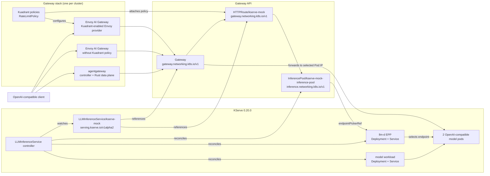

# KServe LLMInferenceService gateway comparison

This repository runs one KServe `LLMInferenceService` through three Gateway API
stacks and compares the resulting data path:

| Stack | Pinned version | Local endpoint |
|---|---:|---|
| Kuadrant + Envoy AI Gateway | Kuadrant 1.5.2 / Envoy AI Gateway 1.0.0 / Envoy Gateway 1.8.1 | <http://localhost:8082> |
| Envoy AI Gateway | Envoy AI Gateway 1.0.0 / Envoy Gateway 1.8.1 | <http://localhost:8080> |
| agentgateway | agentgateway 1.4.1 | <http://localhost:8081> |
| shared model control plane | KServe 0.20.0 | one installation per cluster |

There is only one inference path in the repository. KServe owns the workload,
Service, llm-d endpoint picker, and `InferencePool`; each gateway receives the
same `HTTPRoute` to that pool.

Kuadrant is not itself a proxy. It augments Envoy Gateway with policy while
the Envoy AI Gateway extension handles KServe's `InferencePool`. This makes the
Kuadrant environment the policy-enabled form of the Envoy AI Gateway path; it
attaches a `RateLimitPolicy` to the shared KServe route.

## Quick start

Prerequisites: Docker, kind, kubectl, Helm, curl, and Python 3.

```bash
make up
make compare
```

`make up` creates three kind clusters. The first run downloads container images
but all Helm charts are pinned and vendored in the repository.

For the Kuadrant stack, installation order matters:

1. install the Gateway API Inference Extension CRD and Envoy `InferencePool` RBAC;
2. let Envoy Gateway's Helm chart own the core Gateway API CRDs;
3. start the Envoy AI Gateway extension, then restart Envoy Gateway;
4. install Kuadrant with EnvoyPatchPolicy support enabled.

Applying the core Gateway API bundle before the Envoy chart causes Helm
server-side-apply ownership conflicts. Installing plain Envoy Gateway without
the AI extension leaves KServe's `InferencePool` backend unresolved.

A direct request is identical for every endpoint:

```bash
curl http://localhost:8082/v1/chat/completions \
  -H 'content-type: application/json' \
  -d '{"model":"mock-kserve","messages":[{"role":"user","content":"hello"}]}'
```

Use ports `8080` and `8081` for Envoy AI Gateway and agentgateway. No
gateway-selection header is required because there is no alternate route.

Useful targets:

```bash
make status
make compare
make agent-ui
make down
```

`make agent-ui` port-forwards the agentgateway UI to
<http://localhost:15000/ui>.

## Deployment dependencies

This repository has one automated deployment target and one documented
platform variant. Do not install both KServe distributions in the same
cluster.

| Condition | Open-source KServe reference | Red Hat OpenShift AI |
|---|---|---|
| Intended use | local development and gateway comparison | OpenShift-managed model serving |
| Kubernetes platform | kind with Kubernetes 1.36.1 | OpenShift Container Platform 4.19.9 or later |
| KServe distribution | upstream KServe 0.20.0, installed by this repository | KServe managed by Red Hat OpenShift AI |
| Platform version | not applicable | Red Hat OpenShift AI 3.5 |
| LLM API | `serving.kserve.io/v1alpha2` `LLMInferenceService` in this pinned upstream release | use the `LLMInferenceService` API installed by the selected OpenShift AI release; currently documented as `serving.kserve.io/v1alpha1` |
| Gateway prerequisite | this repository installs each GatewayClass and Gateway | a `GatewayClass` and `Gateway/openshift-ai-inference` in `openshift-ingress` |
| Model runtime | CPU mock for repeatable tests; use vLLM and GPUs for production | an enabled OpenShift AI serving runtime, normally vLLM for LLMs |
| Installation command | `make up` | install and configure OpenShift AI; do not run `scripts/install-kserve.sh` |
| Validation status here | automated and tested | compatibility guidance only; not automated by this repository |

### Open-source KServe path

The automated kind deployment requires:

- Docker, kind, kubectl, Helm, curl, and Python 3 on the workstation;
- Gateway API and Gateway API Inference Extension CRDs;
- cert-manager 1.17.0;
- upstream KServe 0.20.0;
- one supported gateway stack: Kuadrant + Envoy AI Gateway, Envoy AI Gateway,
  or agentgateway;
- enough local capacity for three kind control-plane nodes and their controller
  and proxy images.

The checked-in CPU fixture does not require a GPU, object store, or model
download. A production vLLM deployment additionally needs supported
accelerators and drivers, model storage or a model registry, image-pull
credentials, and appropriately sized memory and ephemeral storage.

### OpenShift AI path

For the same distributed-inference architecture on OpenShift, target
OpenShift Container Platform 4.19.9 or later with Red Hat OpenShift AI 3.5.
The OpenShift AI model serving platform must already be enabled and must own
the KServe installation.

Additional conditions from the OpenShift AI distributed-inference deployment
guide:

- OpenShift Service Mesh v2 must not be installed for this Gateway API
  distributed-inference topology;
- the cluster must provide `GatewayClass` and
  `Gateway/openshift-ai-inference` in `openshift-ingress`;
- bare-metal clusters need an external entry point for the Gateway Service,
  such as MetalLB;
- authentication must be configured for the inference endpoint;
- LeaderWorkerSet is optional for ordinary deployments and is required when a
  server's tensor, pipeline, or data parallelism spans more than eight
  accelerators.

The upstream manifest is therefore a schema reference, not a directly
portable OpenShift installation bundle. For OpenShift, use the API version
served by the OpenShift AI-managed KServe operator, reference the
`openshift-ai-inference` Gateway, replace the mock container with an enabled
serving runtime, and apply the cluster's storage, accelerator, security, and
authentication requirements.

Version conditions were checked against the
[OpenShift AI 3.5 distributed inference guide](https://docs.redhat.com/en/documentation/red_hat_openshift_ai_self-managed/3.5/html/deploy_models_using_distributed_inference_with_llm-d/deploying-models-using-distributed-inference_distributed-inference).
Confirm the Red Hat supported-configuration matrix for the exact z-stream and
accelerator before a production deployment.

## Architecture

Each box below exists independently in each kind cluster. The KServe manifest
is byte-for-byte identical across the three environments.



## Resource schema

The repository declares only the portable resources needed around KServe:

| Owner | Resource | Purpose |
|---|---|---|
| repository | `GatewayClass` / `Gateway` | selects each gateway implementation |
| repository | `HTTPRoute/kserve-mock` | sends `/v1` traffic to the KServe pool |
| repository | `LLMInferenceService/kserve-mock` | desired model, workload, replicas, router, and scheduler |
| repository | two `LLMInferenceServiceConfig` objects | replace GPU/vLLM defaults with the complete CPU fixture |
| repository, Kuadrant cluster only | `RateLimitPolicy/kserve-mock` | proves Kuadrant policy attachment without constraining the sample |
| KServe controller | workload `Deployment` and `Service` | runs two model replicas |
| KServe controller | scheduler `Deployment` and `Service` | runs the llm-d endpoint picker |
| KServe controller | `InferencePool` and scheduler RBAC | exposes endpoint-aware routing to the gateway |

The core desired state is:

```yaml
apiVersion: serving.kserve.io/v1alpha2
kind: LLMInferenceService
metadata:
  name: kserve-mock
  namespace: ai-demo
spec:
  replicas: 2
  model:
    uri: hf://local/kserve-mock
    name: mock-kserve
  router:
    gateway:
      refs:
        - name: ai-gateway
    route:
      http:
        refs:
          - name: kserve-mock
    scheduler:
      pool:
        spec:
          endpointPickerRef:
            name: kserve-mock-epp-service
            port:
              number: 9002
```

See [kserve/README.md](kserve/README.md) for the fixture-specific choices and
the production model upgrade path.

## What the comparison measures

`make compare` checks:

- `Gateway` Programmed and `HTTPRoute` Accepted/ResolvedRefs conditions;
- `LLMInferenceService` Ready and its two workload replicas;
- KServe controller ownership of the generated workload, Services, scheduler,
  and pool;
- successful distribution across both model pods;
- OpenAI streaming with a usage chunk;
- local p50 request latency;
- Kuadrant `RateLimitPolicy` readiness.

Raw Markdown results are written to `compare/results/`. The latency value is a
local smoke-test against a zero-delay Python runtime. It is useful for catching
regressions in this fixture, not for ranking production gateways.

The first two columns use the same Envoy AI Gateway and Envoy Gateway versions:
one with Kuadrant policy and one without. The third uses agentgateway's Rust
proxy. This isolates the effect of the Kuadrant policy layer more cleanly.

## Latest result

The validated run on 24 August 2026 used 30 requests per gateway:

| Check | Kuadrant + Envoy AI Gateway | Envoy AI Gateway | agentgateway |
|---|---:|---:|---:|
| successful requests | 30/30 | 30/30 | 30/30 |
| selected model pods | 2 | 2 | 2 |
| streaming usage | yes | yes | yes |
| local p50 | 88 ms | 85 ms | 64 ms |

All Gateways were Programmed, all routes were Accepted/ResolvedRefs, and all
`LLMInferenceService` objects were Ready with 2/2 workload replicas. See the
[raw comparison result](compare/results/comparison-20260824-101555.md).

## Why three clusters

The gateway charts own cluster-scoped Gateway API and extension CRDs on
different release matrices. One cluster per stack prevents one installer from
upgrading another stack's CRDs and makes teardown deterministic.

## Repository layout

```text
clusters/             three kind cluster definitions
kuadrant/             Envoy provider, Kuadrant instance, and route policy
envoy-ai-gateway/     pinned charts, values, and Gateway
agentgateway/         pinned charts, values, and Gateway
kserve/               controller charts, LLMInferenceService, route, and presets
mock-llm/              CPU OpenAI-compatible runtime used by KServe
scripts/               install and deployment orchestration
compare/               single three-gateway KServe comparison and raw results
```

## Production model

The laptop fixture disables storage initialization and mounts a small Python
server from a ConfigMap. To use a real model, replace the inline workload
container with the KServe runtime preset and model URI appropriate for vLLM,
restore GPU resources, storage initialization, and the telemetry-aware
scheduler plugins.

References:

- [KServe LLMInferenceService installation](https://kserve.github.io/website/docs/install/llmisvc-install)
- [KServe LLMInferenceService architecture](https://kserve.github.io/website/docs/concepts/architecture/control-plane-llmisvc)
- [Kuadrant overview](https://docs.kuadrant.io/)
- [Kuadrant Helm installation](https://docs.kuadrant.io/dev/install-helm/)
